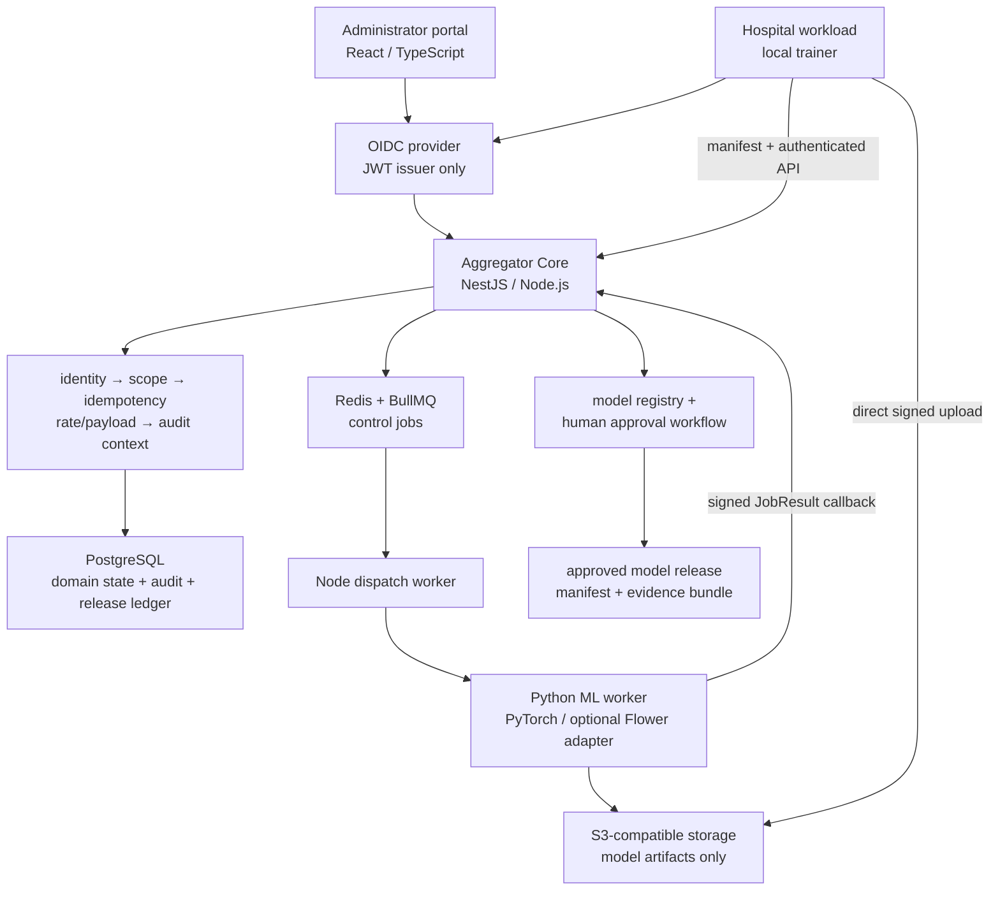
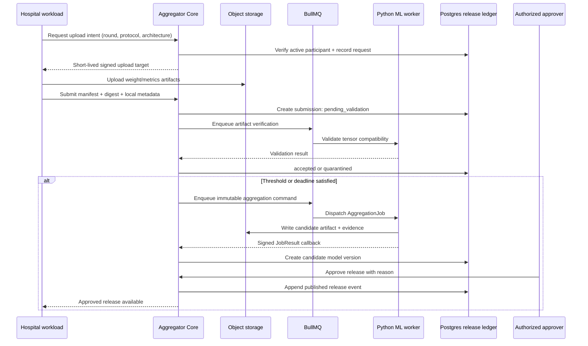

# Full Aggregator Core System Requirements Analysis

**Status:** Proposed architecture specification.  
**Product:** Federated Aggregator Core and future administrator portal.  
**Primary purpose:** Accept verified hospital model-update manifests, coordinate FedAvg/FedProx-compatible aggregation work, and publish governed model releases without collecting raw patient images or local training datasets.

## Technology stack — proposed for approval

| Layer | Proposed choice | Responsibility |
|---|---|---|
| Human authentication | OIDC-compatible provider; Keycloak is the self-hosted default | Sign-in and JWT issuance only |
| Core backend | NestJS + Node.js + TypeScript | Business logic, federation policy, authorization, round state, audit, release governance |
| Database | PostgreSQL | Authoritative domain state, audit events, model/version lineage, protocol records |
| Artifact storage | S3-compatible object storage; MinIO locally | Model weights, metrics bundles, manifests, release packages |
| Async control jobs | BullMQ + Redis | Retries, dispatch, artifact verification, release publication, notification/outbox work |
| ML execution | Python + PyTorch + FastAPI worker boundary | Tensor validation, aggregation, candidate evaluation, FedAvg/FedProx reference logic |
| Future FL framework adapter | Flower, after baseline contracts pass | Standardized Python FL strategy/client integration; not governance or registry replacement [1] |
| API contract and reference | OpenAPI 3.1 + Scalar | Versioned backend contract and safe mock/local interactive reference |
| Future administrator client | Separate React/TypeScript portal | Human administration only; it never bypasses backend authorization |

The Node.js backend is the **single source of truth** for who may do what, which federation protocol is active, whether a submission is valid, and whether a candidate model may be released. The Python worker is a controlled calculation service: it can create an aggregation result, but it cannot create users, approve releases, or mutate PostgreSQL directly.

## 1. Authentication, workload identity, and session architecture

Human users authenticate through an OIDC-compatible identity provider. The provider issues a signed JWT; it does not own federation roles, organization membership, release permissions, or model data. Each portal/API request presents the JWT as a Bearer token. The NestJS backend verifies the signature with the provider’s public keys, extracts the stable subject identifier, then hydrates the user’s permitted federation and role from PostgreSQL.

Hospital workloads and the Python ML worker are not human users. They use distinct short-lived workload credentials—initially signed client credentials over mTLS or a private-network token exchange. A human administrator’s browser session must never be repurposed as a hospital-node or worker credential.

Every externally reachable request follows this middleware chain.

| Step | Middleware | Required behavior |
|---|---|---|
| 1 | Request context | Generate/accept a correlation ID, record request metadata, and reject malformed headers |
| 2 | Credential verification | Verify OIDC JWT for a human or workload credential for a machine; attach principal type and stable subject |
| 3 | User/workload hydration | Look up organization, federation membership, role, workload status, and revocation state from PostgreSQL |
| 4 | Scope and policy guard | Verify the action, federation, round, and organization scope; deny cross-site access by default |
| 5 | Idempotency guard | For write operations, replay a prior successful result when the same idempotency key is reused |
| 6 | Rate and payload guard | Limit requests by principal and route; reject oversized/unsupported bodies before business logic |
| 7 | Audit context | Attach principal, correlation ID, request ID, and authorization decision to the domain action |

Role enforcement lives in PostgreSQL-backed policy, not in frontend visibility or identity-provider custom claims. Initial roles are `platform_admin`, `research_admin`, `site_admin`, `site_workload`, `auditor`, and `research_reader`. Every role is constrained by organization and federation scope.

## 2. NestJS backend structure

The backend begins as a **modular monolith**. Modules are separate by domain and test boundary, but are deployed together until the system demonstrates a measured need for distributed control-plane services. NestJS can support request-response and event-style service communication later without forcing an early microservice split.[2]

### Route groups

| Route group | Purpose | Primary principals |
|---|---|---|
| `/api/v1/session` | Return the hydrated caller profile and permitted scopes | Any authenticated principal |
| `/api/v1/federations` | Create/read federation configuration and organization membership | Platform/research administrators |
| `/api/v1/protocols` | Version architecture, preprocessing, optimizer, FedProx `mu`, metric schema, and release criteria | Research administrators |
| `/api/v1/participants` | Register, activate, pause, withdraw, or suspend a site workload | Research/site administrators |
| `/api/v1/rounds` | Create, open, close, cancel, and inspect federated rounds | Research administrators; scoped readers |
| `/api/v1/rounds/{roundId}/submissions` | Allocate upload intent, receive update manifests, display validation outcome | Site workloads; scoped administrators |
| `/api/v1/aggregation-jobs` | Inspect and control queued/running/recovered aggregation work | Research administrators; internal worker callback |
| `/api/v1/model-versions` | Inspect candidates, lineage, artifact manifests, and evaluation evidence | Scoped readers and administrators |
| `/api/v1/releases` | Approve, publish, deprecate, or roll back model releases | Authorized release approvers only |
| `/api/v1/audit` | Filter/export durable domain events | Auditors and authorized administrators |
| `/api/v1/admin` | Internal operational controls, policy configuration, and incident actions | Platform administrators only |

## 3. Model-update intake and artifact pipeline

A hospital does **not** send raw images, patient identifiers, local datasets, or an unverified weight file through the public API. It first requests an upload intent for the round’s permitted architecture and protocol. The backend verifies that the caller is an active workload participant for that exact federation and round, then returns a short-lived, scope-limited object-storage upload path.

The hospital uploads its model-update artifact directly to object storage and submits a small JSON manifest to the backend. The manifest includes the round/protocol/architecture IDs, global-model base version, sample count, local training metadata, SHA-256 digest, storage key, metrics bundle reference, and declared FedProx configuration. The server validates schema, participant eligibility, deadline, idempotency, digest format, base-model lineage, and duplicate submission rules. It records a **pending validation** submission; it does not immediately claim that the update is accepted.

BullMQ then dispatches artifact verification. A Node-side verifier confirms storage existence, size, digest, and immutable storage metadata. The Python worker performs ML-specific compatibility checks—state-dict keys, shapes, dtypes, finite tensors, and protocol/architecture compatibility. A failing submission enters `quarantined` with a durable reason code. A passing submission becomes `accepted` and is eligible for the aggregation threshold.

## 4. Federated round and model-release lifecycle

The round workflow is intentionally explicit:

1. A research administrator creates an immutable protocol version and a draft round linked to an approved global base model.
2. The round is opened only after the chosen participants, deadline, threshold, and release criteria are visible.
3. A hospital retrieves the permitted base model and trains locally. In FedProx, the hospital-side training loss includes the proximal term against that received global state; the central aggregator does not “apply FedProx” merely by averaging weights.[3]
4. The hospital uploads its update artifact and submits the signed manifest.
5. The backend and ML worker validate the update, record acceptance/quarantine evidence, and prevent duplicates.
6. When the round reaches its declared threshold or deadline, the backend creates one immutable aggregation job.
7. The Python worker aggregates only the accepted, compatible updates, creates a candidate artifact, and returns a result bundle.
8. The backend creates a candidate model version, links every accepted/excluded submission, and requires evaluation evidence and human approval.
9. An authorized approver publishes a release bundle or rejects/deprecates the candidate. Publication is reversible through a later rollback event, never by overwriting history.

## 5. BullMQ job queue — detailed design

BullMQ runs on Redis and is used by the **Node.js control plane** for durable control tasks. Python does not need to be a direct BullMQ consumer. A Node dispatcher invokes the Python worker over the authenticated internal contract and converts the worker’s callback into durable domain events. This avoids requiring a Python reimplementation of BullMQ semantics in the first release.

| Queue | Trigger | Worker behavior | Result |
|---|---|---|---|
| `aggregator:artifact-verify` | New update manifest | Verify object presence, size, checksum, immutable metadata; request ML compatibility check | Submission accepted or quarantined |
| `aggregator:aggregate` | Round threshold/deadline met | Dispatch versioned aggregation command to Python; monitor callback/timeout | Candidate artifact or explicit failure |
| `aggregator:evaluate` | Candidate created | Dispatch configured reference/candidate evaluation job | Metrics/evidence bundle linked to candidate |
| `aggregator:release-publish` | Human approval recorded | Assemble immutable release package, mark release visible, write audit/outbox event | Published or failed release state |
| `aggregator:outbox` | Domain transaction emits event | Deliver future notification/webhook/analytics actions without coupling them to request handling | Delivered/retried/dead-lettered event |
| `aggregator:audit-export` | Authorized export request | Produce a scoped, redacted audit export asynchronously | Downloadable evidence package |

Each job follows `queued → running → succeeded | retrying | failed | cancelled`. Jobs retry at most three times with exponential backoff only when their failure is classified as transient. Terminal failures do not silently advance round or release state. The original aggregation command and the worker result are persisted, including correlation ID, idempotency key, code revision, input artifact IDs, environment, and timestamps.

## 6. Python ML worker and FedProx contract

The Python worker is a separate service/package. It accepts a versioned `AggregationJob` command and returns a `JobResult` callback. The first transport is authenticated HTTPS; OpenAPI/JSON Schema describes both directions. The later decision to introduce NATS JetStream must be based on measured worker concurrency, recovery, and delivery requirements rather than architecture fashion.

### `AggregationJob` minimum fields

| Field | Meaning |
|---|---|
| `job_id`, `correlation_id`, `schema_version` | Stable identity and contract version |
| `federation_id`, `round_id`, `protocol_version` | Governance scope and immutable method reference |
| `algorithm` | `fedavg` or `fedprox-compatible`; FedProx client settings are recorded, not recomputed centrally |
| `base_model` | Verified model-version ID and artifact descriptor |
| `accepted_updates` | Ordered, verified artifact descriptors with sample counts and metadata |
| `aggregation_policy` | Floating-tensor weighting, integer-buffer rule, BatchNorm policy, threshold settings |
| `environment` | Python/PyTorch/worker version, hardware class, deterministic-seed policy |
| `deadline` | No late result may mutate the round after this boundary without manual recovery |

### `JobResult` minimum fields

The result includes status, model/candidate artifact descriptor, checksum, validation summary, accepted/excluded update IDs, aggregation metrics, environment manifest, warnings, and failure reason when applicable. The control plane validates that it is the expected result for the expected job before it creates or updates any candidate model version.

The existing clean-room Python `federated_core.py` is reused as a tested reference library because it already validates state-dict compatibility, finite values, sample-weighted floating tensors, integer-buffer handling, and the local FedProx penalty. It must be extended with artifact I/O, a tested BatchNorm policy for the actual vision architecture, structured worker results, device control, and reproducibility manifest generation.

## 7. Model registry, release ledger, and audit trail

The core uses append-only events for all consequential model-status changes. A release is a **new immutable event**, never a mutable flag that removes the prior state. The current view can be materialized for fast reads, but the ledger remains the source of truth.

| Table | Key fields | Purpose |
|---|---|---|
| `model_versions` | ID, base version, round ID, protocol ID, artifact ID, state, created timestamp | Materialized current candidate/release view |
| `model_release_events` | ID, model version ID, event type, actor, reason, evidence IDs, timestamp | Append-only lifecycle: `candidate_created`, `approved`, `published`, `deprecated`, `rolled_back` |
| `audit_events` | ID, actor, action, target type/ID, correlation ID, payload summary, timestamp | Cross-domain human and workload accountability |
| `artifacts` | ID, storage key, SHA-256, size, content type, producer version, retention policy | Verifiable object-storage metadata |
| `outbox_events` | ID, event type, aggregate ID, payload, delivery status, timestamp | Transactional hand-off to async work and future integrations |

## 8. PostgreSQL schema — key tables

| Table | Essential fields |
|---|---|
| `users` | `id`, `oidc_subject`, `email`, `display_name`, `status`, `created_at` |
| `organizations` | `id`, `name`, `status`, `created_at` |
| `memberships` | `user_id`, `organization_id`, `role`, `status`, `created_at` |
| `workloads` | `id`, `organization_id`, `credential_subject`, `kind`, `status`, `last_seen_at` |
| `federations` | `id`, `name`, `owner_organization_id`, `status`, `created_at` |
| `federation_participants` | `federation_id`, `organization_id`, `workload_id`, `status`, `joined_at`, `withdrawn_at` |
| `protocol_versions` | `id`, `federation_id`, `version`, `architecture_id`, `algorithm`, `config_json`, `release_criteria_json`, `created_by` |
| `rounds` | `id`, `federation_id`, `protocol_version_id`, `base_model_version_id`, `state`, `threshold`, `deadline`, `created_by` |
| `update_submissions` | `id`, `round_id`, `workload_id`, `artifact_id`, `manifest_json`, `status`, `reason_code`, `submitted_at` |
| `aggregation_jobs` | `id`, `round_id`, `command_json`, `status`, `worker_job_id`, `result_artifact_id`, `attempts`, `correlation_id` |
| `model_versions` | `id`, `round_id`, `base_model_version_id`, `artifact_id`, `state`, `created_at` |
| `model_release_events` | `id`, `model_version_id`, `event_type`, `actor_id`, `reason`, `evidence_json`, `created_at` |
| `api_idempotency` | `principal_id`, `route`, `key`, `request_hash`, `response_json`, `expires_at` |
| `audit_events` | `id`, `actor_type`, `actor_id`, `action`, `target_type`, `target_id`, `correlation_id`, `payload_summary`, `created_at` |

## 9. System architecture

## 10. Aggregation and release sequence

## 11. What is retained, rebuilt, and deferred from earlier work

The earlier clean-room prototype remains useful but is not deployed as-is. The tested Python aggregation and FedProx primitives are retained as the reference library. The Express round-state logic and test cases inform the new NestJS implementation, but its in-memory storage and unauthenticated endpoints are rebuilt. The in-memory coordination adapter contributes an interface and checksum concept, but is replaced by PostgreSQL, artifact storage, approval events, and rollback records.

The hospital backend/frontend, standalone administrator portal, blockchain registry, and IPFS layer remain separate product lines. They are not embedded into the core backend until their own requirements, threat model, and integration contracts are approved.

## References

[1] Flower, [*Flower Framework documentation*](https://flower.ai/docs/framework/index.html).

[2] NestJS, [*Microservices*](https://docs.nestjs.com/microservices/basics).

[3] Li et al., [*Federated Optimization in Heterogeneous Networks*](https://proceedings.mlsys.org/paper/2020/hash/1f5fe83998a09396ebe6477d9475ba0c-Abstract.html), MLSys, 2020.
