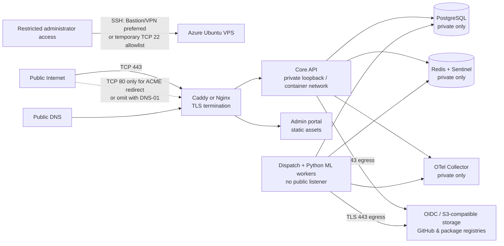

# Azure Linux VPS Hosting Boundary

## Decision summary

The Azure Linux VPS can host the **central control-plane environment**: the Core API, Node.js dispatch worker, Python ML worker, PostgreSQL, Redis/Sentinel, an internal OpenTelemetry Collector, and the reverse proxy serving the Core/API and administrator portal. The current documentation mirror remains on Render, which is already live and needs no VPS migration.

This is a practical integration and staging deployment boundary. It is **not** an authorization to co-locate hospital systems, patient data, clinical images, or unreviewed future applications on the same public host. Hospital nodes must remain institution-controlled or, for development, run as separately isolated private services. The Core continues to receive descriptor-only records; raw patient data and artifact/model bytes never enter the API or PostgreSQL.

> Azure NSG rules are stateful. A response to an allowed initiated connection does not require a second reciprocal rule. Azure processes a rule by priority and applies the first matching rule. [1]

## Target topology

## Azure Network Security Group rules

The following is the minimum rule set for a single-VPS staging deployment. Associate the NSG with the VM NIC or a dedicated application subnet. Azure's default NSG rules allow VirtualNetwork traffic, Azure Load Balancer traffic, and Internet egress; custom rules with a lower numeric priority override those defaults. [1]

| Direction | Priority example | Protocol / port | Source | Destination | Action | Purpose |
|---|---:|---|---|---|---|---|
| Inbound | 100 | TCP 443 | Internet | VPS public IP | Allow | Public HTTPS for Core/API and portal through the reverse proxy. |
| Inbound | 110 | TCP 80 | Internet | VPS public IP | Allow only if HTTP-01 ACME is used | Certificate issuance and HTTPS redirect. Omit when using DNS-01 validation. |
| Inbound | 120 | TCP 22 | Azure Bastion subnet, point-to-site VPN range, or a temporary single approved operator CIDR | VPS private/public IP | Allow | SSH administration. Prefer Bastion or VPN; never make this a permanent `0.0.0.0/0` rule. |
| Inbound | 130 | TCP 443 | Hospital-node private subnet or defined mTLS client network | VPS private IP | Allow when private connectivity is introduced | Future hospital workload/API ingress, after separate trust and mTLS design. |
| Inbound | 200–399 | Any | Internet | 3000, 5432, 6379, 26379, 4317, 4318, 8888, 9090, 3000/Grafana | Deny by absence of allow rule | These ports must never be publicly exposed. |
| Outbound | 100 | TCP 443 | VPS | Approved external services | Allow | OIDC/JWKS, S3-compatible storage, GitHub, container and package registries, Azure Key Vault, HTTPS package sources, and ACME services. |
| Outbound | 110 | UDP/TCP 53 | VPS | Approved DNS resolver | Allow | DNS resolution. Use the Azure-provided resolver or an approved internal resolver. |
| Outbound | 120 | UDP 123 | VPS | Approved NTP service | Allow | Time synchronization for certificates, JWT validation, audit timestamps, and attestation freshness. |
| Outbound | 130 | TCP 80 | VPS | Approved bootstrap mirror only | Temporary | Bootstrap package installation only; remove after HTTPS-based package sources are configured. |
| Outbound | 140 | TCP 22 | VPS | Internet | Deny by absence of allow rule | Not required when Git access uses HTTPS. |
| Outbound | 400 | Any | VPS | Internet | Deny after approved egress controls exist | Enforce only after all mandatory FQDN dependencies are tested. |

### Important egress limitation

An NSG filters addresses, service tags, protocols, and ports; it is not an FQDN allowlist. The Core needs HTTPS access to changing provider endpoints such as an OIDC issuer/JWKS endpoint, an S3-compatible storage endpoint, GitHub, and package/container registries. For a strict production egress allowlist, use an Azure Firewall or controlled egress proxy with FQDN-aware policy rather than attempting to maintain provider IP ranges manually. Azure also recommends centralized network controls and logical segmentation, rather than broad allow ranges. [1] [2]

## Host port binding policy

Only the reverse proxy binds to the VPS public interfaces. All other services bind to `127.0.0.1` or an internal container network.

| Component | Host exposure | Internal port guidance | Public exposure |
|---|---|---:|---|
| Reverse proxy | Public | 80, 443 | Allowed only through NSG rules above. |
| Core API | Internal | 3000 or 8080 | Never direct; proxy forwards authenticated HTTPS traffic. |
| Administrator portal | Internal/static | Proxy-served | Never a separate public dev-server port. |
| PostgreSQL | Private | 5432 | Never public; encrypted backups go to approved storage. |
| Redis primary/replicas | Private | 6379 | Never public. |
| Redis Sentinel | Private | 26379 | Never public; only private network peers when multi-host. |
| BullMQ workers | No listener | Redis client only | No public port. |
| Python ML worker | No listener except authenticated callback path through API | Application-defined | No public worker port. |
| OTel Collector | Private | 4317, 4318, 13133, 8888/8889 as configured | Never public. |
| Prometheus/Grafana, if later introduced | Private or VPN/Bastion-only | 9090, 3000 | Do not expose directly to Internet. |

## SSH access boundary

Azure recommends SSH key authentication for Linux VMs and notes that SSH typically uses TCP port 22. It also recommends validating the server host fingerprint before the first connection. [3] Direct Internet SSH should be avoided for production where Azure Bastion or a VPN is available; Microsoft specifically advises disabling direct SSH/RDP exposure and recommends Bastion or just-in-time access for remote administration. [2]

Before SSH onboarding, create a dedicated non-root `fedagg-operator` account with password authentication disabled. It should have narrowly scoped sudo access, a dedicated deployment directory, and no database or cloud credentials in shell history. The user should provide the VPS hostname or IP, the operator username, the SSH port, and the server host-key fingerprint through the task; the agent will provide a deployment-specific **public** key for installation. Do not send a password or private SSH key in chat.

## Implementation sequence after access

1. The VPS is hardened first: Ubuntu updates, non-root operator, SSH key-only access, host firewall coordinated with the NSG, automatic security updates, disk encryption/backup policy, and time synchronization.
2. The deployment foundation follows: Docker/Compose, separate private networks, encrypted secrets outside Git, reverse proxy/TLS, log rotation, PostgreSQL backup and restore test, and bounded health endpoints.
3. The Core deployment then brings up PostgreSQL, Redis, the Core API, dispatch worker, and Python worker. The administrator portal is served from the reverse proxy; the current documentation mirror remains on Render.
4. Runtime evidence is collected: readiness, restricted-route authorization, descriptor-only boundary, queue delivery, backup/restore, TLS renewal, and the Phase 15 Redis Sentinel/Collector failover procedure.

## References

[1] [Azure network security groups overview](https://learn.microsoft.com/en-us/azure/virtual-network/network-security-groups-overview)

[2] [Azure network security best practices](https://learn.microsoft.com/en-us/azure/security/fundamentals/network-best-practices)

[3] [Connect to a Linux VM in Azure](https://learn.microsoft.com/en-us/azure/virtual-machines/linux-vm-connect)
