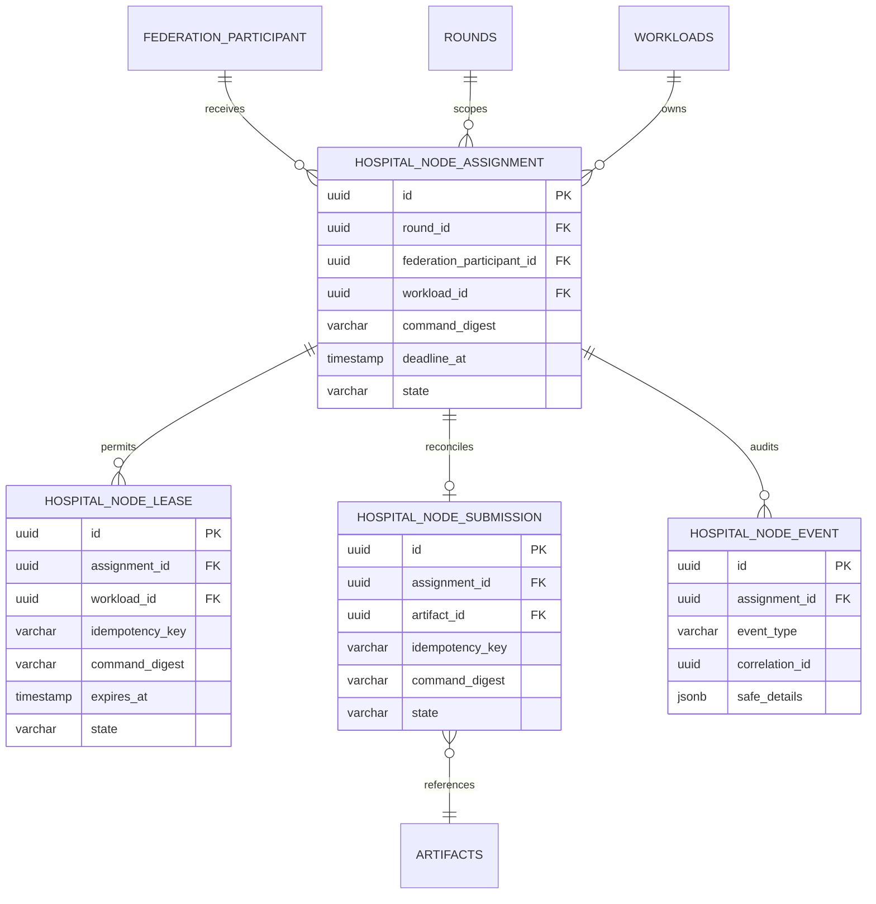
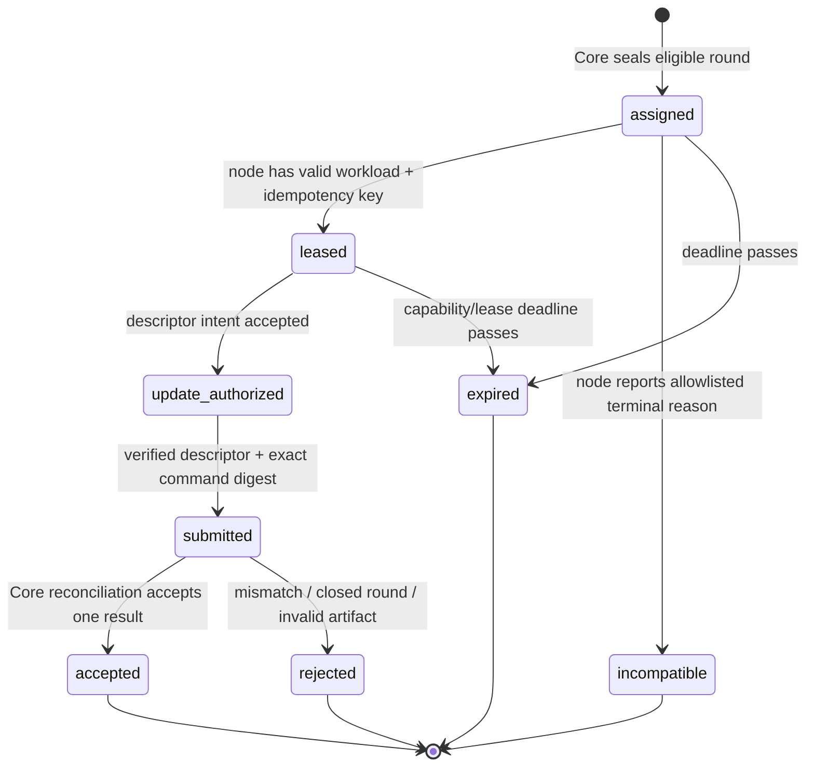

# Core — Hospital Node Workload Contract Design

**Status:** Proposed additive Core design; no Core route, migration, or Azure integration is implemented by this document.  
**Decision date:** 22 August 2026  
**Depends on:** the public Hospital Node Agent dossier and the current Core artifact, workload-identity, aggregation, and audit boundaries.

## 1. Decision and non-negotiable boundary

The Core will add a **distinct `hospital_node` workload API** for assigned local training. It will not repurpose the human artifact-intent/round routes or the internal `ml_worker` aggregation-result callback. A node receives a round-scoped immutable command, short-lived read/upload capabilities, and submits a descriptor only. The Core remains authority for federation eligibility, protocol, round lifecycle, artifact verification, aggregation, candidate, release, and audit.

> The Core receives no raw image, patient identifier, local path, free-form local log, token, storage credential, model/update byte stream in an HTTP body, or editable local training configuration.

The proposed contract preserves already-existing Core facts: `hospital_node` is already a distinct workload kind alongside `ml_worker`; federation participation relates a workload to a federation; and `model_update_archive` is already an artifact category. The current routes, however, are still not node-usable because their guards/audience/policy remain human-only or `ml_worker`-only. [1] [2]

## 2. Required Core additions

| Concern | Additive design | Explicit non-design |
|---|---|---|
| OIDC audience | New audience **`fedagg-hospital-node`** accepted only by a dedicated `HospitalNodeAuthGuard`. | Reusing the `fedagg-worker-callback` audience or `ml_worker` principal. |
| Principal policy | Require active workload, `workloadKind = hospital_node`, matching organization, active federation participant, assigned open round, and unexpired lease. | Treating a workload as a human membership or granting federation-wide access from a token alone. |
| Assignment | Core-created one-assignment-per-round-participant projection with immutable command digest and deadline. | A node selecting a round, algorithm, model, local epochs, or release. |
| Object transfer | Core service creates existing descriptor-only artifact/upload-intent records after a valid lease. Direct object transfer uses a short-lived capability outside the Core API body. | Returning an object key, long-lived storage credential, or model/update byte stream from a Core route. |
| Submission | Node submits assignment ID, command digest, artifact descriptor, safe summary, and idempotency key. Core verifies exact assignment, verified artifact, checksum, size, and round state. | Allowing an unverified upload, a stale command, or a duplicate submission to affect aggregation twice. |
| Incompatibility | Node may write one allowlisted terminal code with safe environment category. | Patient-data diagnostics, raw Python exception text, dataset paths, or automatic round cancellation. |

## 3. Additive persistence model

The existing `federation_participants`, `rounds`, `artifacts`, `upload_intents`, aggregation job, outbox, round-event, and audit structures remain authoritative. The new tables link to them; they do not duplicate protocol, artifact bytes, object locators, human memberships, or OIDC secrets.

| Table | Core-owned fields | Critical constraints |
|---|---|---|
| `hospital_node_assignments` | round, participant, workload, immutable command digest, deadline, state, correlation ID. | Unique `(round_id, workload_id)`; active participant/workload must match at creation; no command JSON with data/local path fields. |
| `hospital_node_leases` | assignment, workload, idempotency key, command digest, issued/expiry/consumed/revoked state. | Unique `(assignment_id, idempotency_key)`; one active lease per assignment; expiry is enforced transactionally. |
| `hospital_node_submissions` | assignment, artifact ID, command digest, idempotency key, allowlisted summary, submission state. | Unique assignment and idempotency constraints; artifact must belong to assigned organization/round, have category `model_update_archive`, and be verified. |
| `hospital_node_events` | assignment event type, Core correlation ID, allowlisted reason/environment category, timestamp. | Append-only; safe-detail schema rejects unknown keys and all text blobs. |

## 4. Lifecycle and transaction rules

The assignment is created by a Core round service only after a round has the required frozen protocol/base-model facts and the participant’s active `hospital_node` workload is eligible. Leasing must atomically confirm principal, assignment, participant, round, deadline, and idempotency conditions before returning the canonical command. Update intent must atomically bind the new artifact record to the assignment and current lease. Submission must atomically ensure that the artifact is verified, descriptor fields equal the stored expected values, the assignment command digest equals the node-provided digest, and no accepted/terminal duplicate exists. On success it records safe audit/event/outbox evidence; aggregation dispatch proceeds under the existing Core policy rather than from the node itself.

An unknown transport outcome is never treated as permission to retrain or duplicate-submit. The node reuses the idempotency key and the Core returns the prior safe result. A capability/lease expiry is terminal for that capability and may require a new lease only while the assignment deadline and round remain open.

## 5. Proposed HTTP surface

All routes require `HospitalNodeAuthGuard` and the `fedagg-hospital-node` audience. They return no raw model/update bytes, object locator, credential, raw audit details, protected human policy, or other workload’s assignment.

| Route | Request | Safe response | Invariants |
|---|---|---|---|
| `GET /v1/workloads/self/assignments?cursor=` | Cursor only. | Assigned ID, status, expiry/deadline, digest summary, opaque cursor. | Returns only active principal’s eligible assignments. |
| `POST /v1/workload-assignments/:assignmentId/lease` | Idempotency key. | Immutable command; time-bounded **read capability** response. | Exact principal/assignment/workload; canonical command digest; no route chooses training configuration. |
| `POST /v1/workload-assignments/:assignmentId/update-intents` | Lease/idempotency binding; content type; expected checksum and size; manifest digest. | Artifact ID and time-bounded **write capability** response. | Assignment must be leased/open; creates only `model_update_archive`; no storage locator in Core persistent/event response. |
| `POST /v1/workload-assignments/:assignmentId/submissions` | Artifact ID, checksum/size/manifest digest, command digest, bounded training summary, idempotency key. | Accepted/rejected/retry-safe status plus correlation ID. | Verified descriptor, exact assignment binding, exact digest, one terminal result. |
| `POST /v1/workload-assignments/:assignmentId/outcomes` | Allowlisted incompatibility code and bounded environment category; idempotency key. | Recorded terminal safe outcome and correlation ID. | Cannot update an accepted/expired assignment or include arbitrary diagnostics. |

## 6. Command, capability, and submission requirements

The established `hospital-node-command/v1` shape remains the input contract. The Core must calculate its canonical digest itself and return the immutable envelope only after lease authorization. It must reject a node-supplied different digest, unsupported schema, expired command, unknown preprocessing/model digest, non-positive byte count, or a training summary that exceeds protocol policy.

Capabilities are protected response objects rather than database records containing usable storage credentials. Their safe Core evidence contains only assignment ID, operation (`read_base_model` or `write_model_update`), resource digest, expiry, and a non-secret capability ID/digest. The actual transfer mechanism is a provider-issued time-bounded URL/header policy delivered only to the authenticated client; it is never logged, sent to the public docs, or stored in Core SQL.

The summary is an allowlisted object: completed local epochs, policy-approved coarsened sample-count value when enabled, environment fingerprint digest, dataset-declaration digest, and bounded duration/resource category. It has no free text, arrays of metrics, local paths, image/patient fields, host details, raw logs, or update bytes.

## 7. Authorization matrix

| Action | Required principal and state | Must deny |
|---|---|---|
| List or lease | Active `hospital_node`; current assignment workload/organization/participant; assigned and unexpired. | `ml_worker`, human user, inactive workload, another hospital node, expired/terminal assignment. |
| Create update intent | Same active leased hospital node; open round; exact lease/idempotency binding. | Arbitrary artifact intent; other artifact category; stale/consumed lease. |
| Submit update | Same principal; verified bound artifact; open submission state. | Raw bytes, unverified/mismatched artifact, changed command digest, duplicate terminal state, human/ML-worker token. |
| Report incompatibility | Same principal; nonterminal assignment; allowlisted code. | Arbitrary exception string, accepted assignment, another workload’s assignment. |
| Dispatch aggregation | Existing Core-only aggregation policy after valid accepted submissions. | Direct node-triggered aggregation. |

## 8. Required test and evidence sequence

| Layer | Required proof before the next layer |
|---|---|
| Domain/application | Assignment creation eligibility, lease uniqueness, deadline behavior, terminal immutability, digest equality, idempotent submission/outcome semantics. |
| PostgreSQL/migration | Additive migration; organization/participant/workload/round/artifact FK constraints; rollback-safe transaction tests; no secret/locator column. |
| HTTP/auth | New audience only; `hospital_node` kind required; human and `ml_worker` denial; cross-assignment and cross-organization denial; schema/unknown-field rejection. |
| Artifact | Intent binds assignment/lease; descriptor-only response; checksum/byte/manifest mismatch rejection; verified artifact required. |
| Audit/outbox | Safe event schema/snapshot; no capability/URL/token/bytes; exactly one correlation path for accepted/rejected/incompatible results. |
| Node/Core contract | Shared golden commands/submissions; fake Node adapter exercises capabilities and recovery; no new human-route use. |
| Bounded Azure proof | One generated-tensor node, one `hospital_node` Keycloak client, one assigned test round, one descriptor-backed update, verified reconciliation, and immediate disable/teardown of any temporary service/credential profile. |

## 9. Delivery order and non-claims

1. Add Core domain/application contracts plus additive schema and tests.
2. Add dedicated audience/guard and guarded workload controller with fake storage/identity integration tests.
3. Extend descriptor-intent/verification/reconciliation through the new assignment service only; retain existing human/worker routes unchanged.
4. Use shared Node/Core fixtures and a local simulated node before Azure.
5. Run one bounded Azure synthetic proof only after all contract gates pass; record safe states/digests/IDs, immediately restore default-disabled behavior, and do not describe it as hospital deployment.

This design does **not** authorize a real hospital, clinical trial, real patient data, BreaKHis image transfer, public node endpoint, data-mount on Azure, automatic retry, Redis Sentinel work, blockchain/IPFS, MetaMask/SIWE, or Core release policy change.

## 10. Implementation record — first policy slice

Core commit `79bdcee` implements the first delivery-order item only: shared assignment/lease vocabulary; an explicit Core domain state-transition matrix; a lease-eligibility rule requiring active `hospital_node` kind, active participant, open round, assigned state, and unexpired deadline; an application repository port; and three deterministic application tests. It deliberately has **no** PostgreSQL migration, persistence adapter, Nest controller, OIDC audience/guard, Keycloak client, artifact capability, submission path, Node-to-Core request, or Azure synthetic node.

The full Core suite passed locally with 46 TypeScript tests (including database integration coverage) and 9 Python tests. GitHub Core Quality Gates completed successfully in 1 minute 32 seconds; the protected Azure deployment also completed successfully for `79bdcee4d336fb0b587e31310b2c341cf220c2ea`. Public liveness and strict dependency readiness both returned HTTP 200 after that policy-only rollout. The existing worker remains default-disabled; no worker profile, environment example, workload credential, or runtime activation change is part of this commit.

## 11. Implementation record — additive persistence slice

Core commit `31e7588` adds reviewed migration `0010_hospital_node_assignments.sql` and matching Drizzle declarations for Core-owned assignment, lease, and append-only safe-event records. The schema constrains every record through existing federation participant, round, and workload foreign keys; makes `(round_id, workload_id)` unique for assignments; makes `(assignment_id, idempotency_key)` unique for leases; and stores only digest, deadline/state, correlation, safe event type, and a scalar-only safe-details object. It contains no data field, path, token, capability, signed URL, object key, artifact byte, or remote response column.

The full local Core suite again passed with 46 TypeScript tests and 9 Python tests, including migration/integration execution. Core Quality Gates completed successfully in 1 minute 36 seconds and the protected Azure deployment completed successfully for `31e7588f0c57e5f14597e1927b75c5c903a87828`. Public liveness and strict dependency readiness returned HTTP 200 after the migration rollout. The deployment refreshed the existing containers but did not expose or call a hospital-node route; there is still no persistence adapter, controller, audience/guard, Keycloak client, update capability, submission path, real node, hospital data, or worker-gate change.

## References

[1] [Hospital Node Agent Engineering and API Design](https://github.com/hstu-research/federated-aggregator-docs/blob/main/docs/HOSPITAL_NODE_AGENT_ENGINEERING_AND_API.md)

[2] [Hospital Node Agent Data and Schema Design](https://github.com/hstu-research/federated-aggregator-docs/blob/main/docs/HOSPITAL_NODE_AGENT_DATA_AND_SCHEMA.md)

[3] [Core workload identity port](https://github.com/hstu-research/federated-aggregator-core/blob/main/packages/application/src/ports/identity.ts)

[4] [Core persistence schema](https://github.com/hstu-research/federated-aggregator-core/blob/main/packages/persistence-postgres/src/schema.ts)
