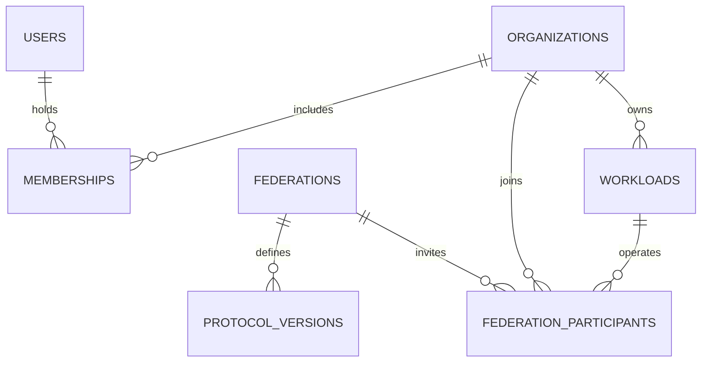
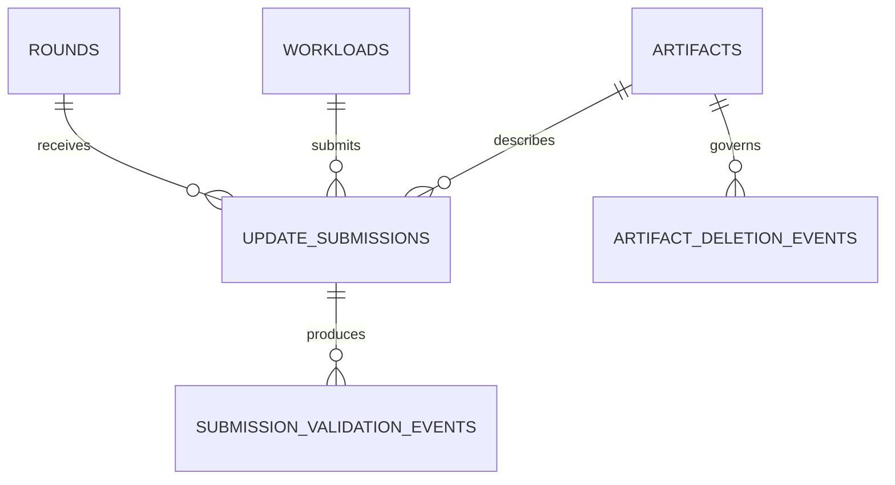
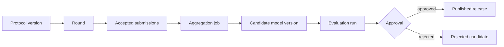

# Federated Aggregator Data Management and Schema Design

## Data-management approach

The aggregator is a **research evidence system**, not a clinical-data warehouse. The data design follows a strict split between local hospital data and central coordination evidence. Hospitals retain patient records, raw images, training datasets, local identifiers, and local preprocessing outputs. The aggregator stores only what is necessary to govern collaboration and reconstruct model lineage: institutional/workload identity, protocol and round records, hashed artifact descriptors, submission manifests, validation outcomes, aggregation/evaluation jobs, candidate/release evidence, and audit events.

This design follows the federated-healthcare expectation that institutions keep control of patient data, approve and monitor research activities, and collaborate without centralizing records.[1] It also responds to the healthcare federated-learning governance need for formal agreements, data provisioning/control, monitoring, clear roles, and harm/misuse mechanisms.[2]

## Group 1: Identity, organization, and federation governance

| Entity | Essential fields | Purpose |
|---|---|---|
| `users` | `id`, `oidc_subject`, `email`, `status`, `created_at` | Human identity reference; no password or token storage |
| `organizations` | `id`, `name`, `status`, `created_at` | Institution/consortium member boundary |
| `memberships` | `user_id`, `organization_id`, `role`, `status`, `expires_at` | Organization-scoped role binding; not a global Boolean admin field |
| `workloads` | `id`, `organization_id`, `credential_subject`, `workload_kind`, `status`, `last_seen_at` | Machine identity for a hospital node or Python worker |
| `federations` | `id`, `owner_organization_id`, `name`, `purpose`, `status` | Defined research collaboration boundary |
| `federation_participants` | `federation_id`, `organization_id`, `workload_id`, `participation_status`, `joined_at`, `withdrawn_at` | Records active, paused, suspended, and withdrawn site involvement |
| `participation_agreements` | `federation_id`, `organization_id`, `version`, `agreement_artifact_id`, `accepted_by`, `accepted_at` | Agreement/provenance record, not a raw legal-document blob in a free-text field |

## Group 2: Protocol, local-data declaration, and rounds

Each `protocol_version` is immutable after a round references it. It contains the declared task, model architecture, local preprocessing commitment, algorithm, FedProx `mu`, epochs, batch size, optimizer, metric schema, BatchNorm policy, update manifest schema, threshold, deadline policy, evaluation plan, and release criteria. The local dataset is represented only by a **declaration**: a non-identifying site-controlled descriptor such as modality, label taxonomy version, sample-count range policy, split rule, and data-snapshot digest. The central system must not receive patient IDs, image paths, records, or a copy of the dataset.

| Entity | Essential fields | Purpose |
|---|---|---|
| `protocol_versions` | `id`, `federation_id`, `version`, `architecture_id`, `algorithm`, `immutable_config`, `created_by` | Immutable scientific/operational method |
| `local_data_declarations` | `id`, `participant_id`, `protocol_version_id`, `dataset_manifest_digest`, `modality`, `label_schema_version`, `split_policy`, `sample_count_policy` | Privacy-safe site statement of eligibility and data conditions |
| `rounds` | `id`, `protocol_version_id`, `base_model_version_id`, `state`, `threshold`, `deadline_at`, `created_by` | Lifecycle-managed collaboration unit |
| `round_events` | `id`, `round_id`, `event_type`, `actor`, `reason`, `occurred_at` | Append-only state, exception, cancellation, and recovery history |

## Group 3: Artifact, manifest, and submission records

The site uploads weights and metrics directly to S3-compatible object storage through a short-lived, round-scoped intent. The database holds an `artifacts` record and a compact `update_submission` manifest. Every artifact must have SHA-256, size, content type, producer version, storage key, retention class, and source relationship. Any failure of digest, size, type, architecture, tensor, protocol, deadline, or base-model compatibility becomes a durable validation event.

| Entity | Essential fields | Purpose |
|---|---|---|
| `artifacts` | `id`, `storage_key`, `sha256`, `byte_size`, `content_type`, `artifact_kind`, `producer_version`, `retention_class` | Trusted metadata for object-storage item |
| `artifact_upload_intents` | `id`, `round_id`, `workload_id`, `artifact_kind`, `expires_at`, `used_at` | Short-lived direct-upload authorization evidence |
| `update_submissions` | `id`, `round_id`, `workload_id`, `artifact_id`, `manifest`, `validation_status`, `reason_code`, `submitted_at` | One declared local update contribution |
| `submission_validation_events` | `id`, `submission_id`, `validator_kind`, `outcome`, `reason_code`, `detail_redacted`, `occurred_at` | Node integrity and Python tensor-validation history |
| `artifact_deletion_events` | `id`, `artifact_id`, `reason`, `authorized_by`, `occurred_at`, `storage_delete_receipt` | Recorded retention/deletion action |

## Group 4: Aggregation, evaluation, model registry, and release ledger

| Entity | Essential fields | Purpose |
|---|---|---|
| `aggregation_jobs` | `id`, `round_id`, `immutable_command`, `status`, `worker_job_id`, `attempt_count`, `correlation_id` | Durable Node→Python command record |
| `worker_attempts` | `id`, `job_id`, `attempt_number`, `worker_version`, `environment_manifest`, `status`, `started_at`, `ended_at` | Retry and reproducibility record |
| `evaluation_runs` | `id`, `model_version_id`, `plan_version`, `status`, `metric_summary`, `evidence_artifact_id` | Candidate assessment record; metric source is explicit |
| `model_versions` | `id`, `round_id`, `base_model_version_id`, `artifact_id`, `state`, `lineage_digest` | Candidate/release model identity |
| `model_cards` | `id`, `model_version_id`, `scope`, `known_limits`, `compatibility`, `intended_research_use` | Human-readable usage boundary |
| `model_release_events` | `id`, `model_version_id`, `event_type`, `actor_id`, `reason`, `evidence_refs`, `occurred_at` | Append-only candidate, approval, publish, reject, deprecate, rollback ledger |

## Group 5: Audit, security, retention, and operational data

| Entity | Essential fields | Purpose |
|---|---|---|
| `audit_events` | `actor_type`, `actor_id`, `action`, `target_type`, `target_id`, `correlation_id`, `payload_summary`, `occurred_at` | Cross-domain account of consequential action |
| `api_idempotency` | `principal_id`, `route`, `idempotency_key`, `request_hash`, `response_summary`, `expires_at` | Prevent duplicate side effects from retried writes |
| `outbox_events` | `aggregate_type`, `aggregate_id`, `event_type`, `payload`, `delivery_status` | Transactional hand-off to queue/notification/webhook work |
| `security_incidents` | `id`, `classification`, `affected_scope`, `status`, `opened_at`, `resolved_at` | Managed response to suspected misuse or compromise |
| `access_reviews` | `id`, `federation_id`, `review_period`, `reviewer_id`, `outcome`, `evidence_artifact_id` | Periodic review of active users/workloads and role scope |
| `retention_policies` | `id`, `data_class`, `duration`, `legal_hold_rule`, `deletion_method`, `version` | Governed, versioned retention policy |

## Retention and integrity rules

Protocol versions, participation agreements, round events, validation outcomes, candidate/release history, audit events, and evidence bundles are retained as required by the approved research agreement and policy. Operational logs have shorter redacted retention. A legal hold prevents deletion but does not grant broader access. Any deletion must create an `artifact_deletion_event`; no background process may silently remove an evidence object.

The integrity rules are: raw data never enters the core; referenced artifacts require digest and size verification; submissions are immutable after final validation; a candidate’s lineage digest covers protocol, accepted updates, base model, command, and output artifact; model state changes are events, not overwritten flags; and a thesis metric cannot be reported without linked dataset manifest, split procedure, code revision, environment, and evaluation evidence.

## References

[1] Fed-BioMed, [*Collaborative learning in healthcare*](https://fedbiomed.org/).

[2] Eden et al., [*A scoping review of the governance of federated learning in healthcare*](https://www.nature.com/articles/s41746-025-01836-3), *npj Digital Medicine*, 2025.
