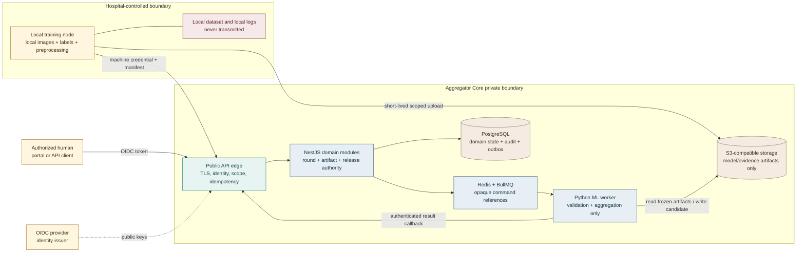
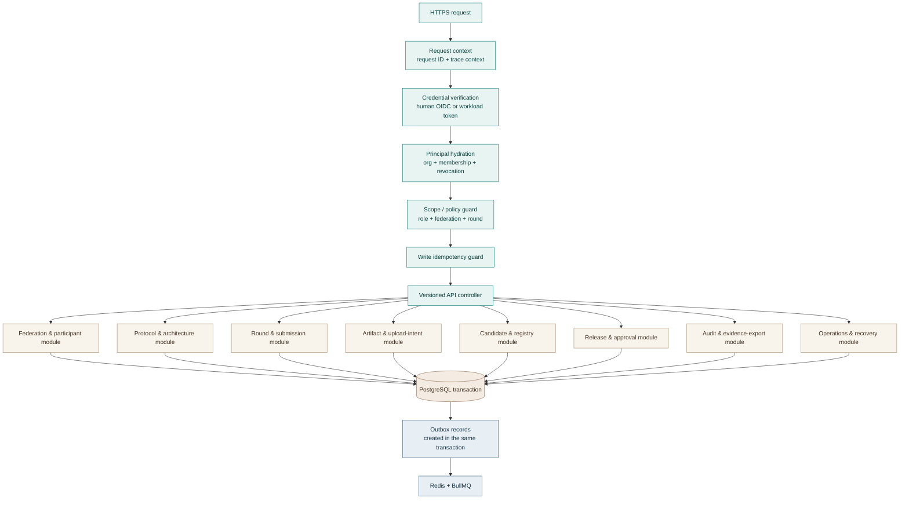
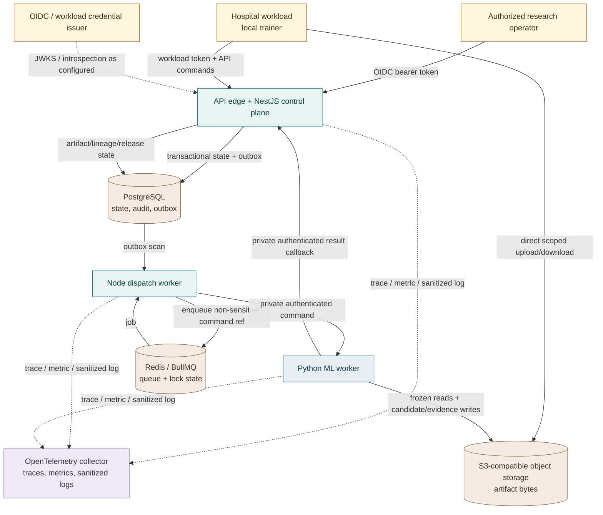
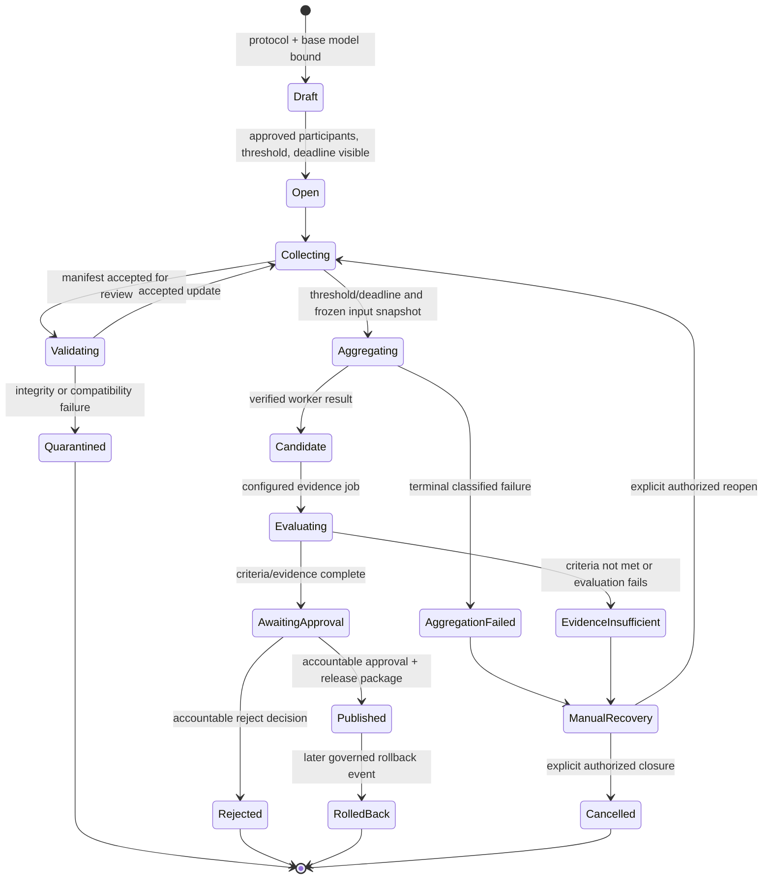
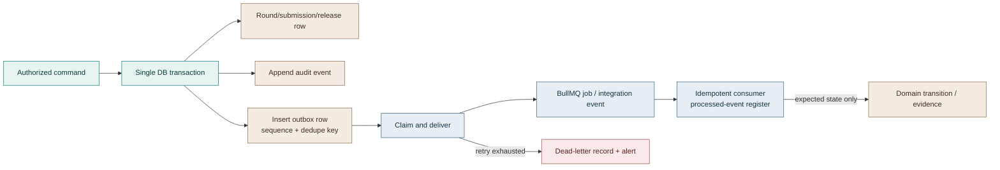
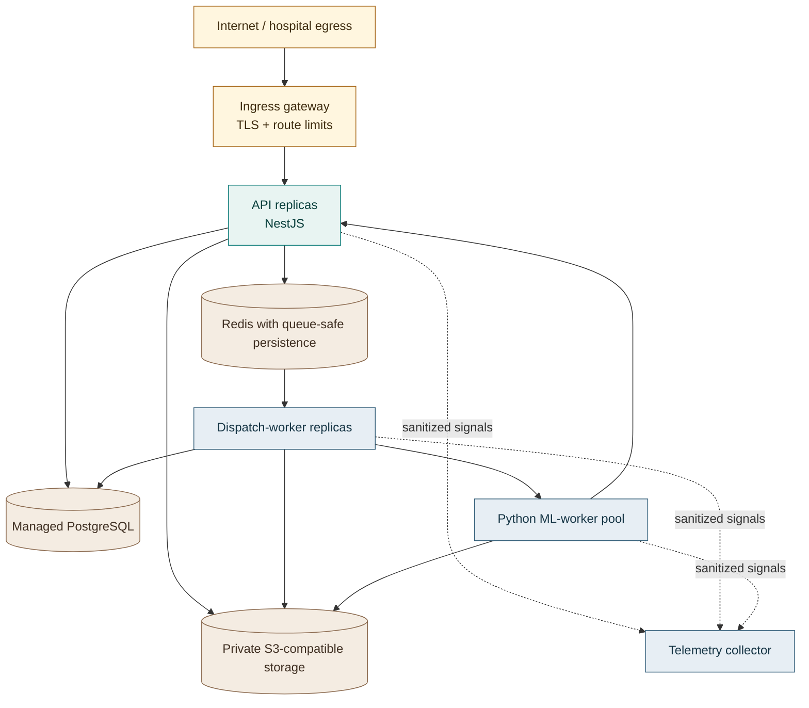

# Full System Architecture and Wiring — Federated Aggregator Core

**Status:** Research-backed architecture specification; implementation begins only after component and contract approval.  
**Product boundary:** Central federation control plane for research-stage breast-cancer histopathology model collaboration.  
**Core promise:** Coordinate governed model-update aggregation and model release without receiving raw patient images, local datasets, or patient identifiers.

## 1. Executive architecture decision

The first product is a **modular-monolith control plane with an isolated Python computation boundary**. A NestJS service owns identities, scope checks, protocol configuration, round state, artifact metadata, durable audit records, and model-release decisions. PostgreSQL is the authoritative record of domain state. Object storage holds model/update/evidence blobs; it does not decide whether those blobs are trustworthy. Redis/BullMQ executes bounded, retriable control tasks. A Python/PyTorch ML worker validates tensors and computes candidate artifacts, but it cannot approve releases or write domain tables directly.

This is deliberately narrower than a generic “federated learning platform.” It does not contain hospital information systems, local clinical workflows, a hospital UI, billing, a marketplace, patient-data exchange, blockchain, IPFS, or a production clinical-decision function. The core is a governed aggregator and release ledger.

> **Design invariant:** An artifact becomes usable only when its identity, provenance, integrity, protocol compatibility, and policy status are all recorded by the control plane. An object-storage key, queue event, or worker callback is never enough on its own.

The server-centric round pattern follows the established model in which the central service distributes an approved global model, participating sites train locally, sites return updates, and the server aggregates them; local data remain with the site. In healthcare, this boundary reduces raw-data movement but does not erase risks associated with model updates, so the architecture retains validation, traceability, and a research-only release gate.[1]

| Architecture choice | Decision | Why it is used | What it does **not** promise |
|---|---|---|---|
| Control plane | NestJS + TypeScript modular monolith | Keeps authorization, state transitions, audit, and release policy in one transactional boundary. | A microservice mesh or automatic multi-region resilience. |
| Scientific compute | Python + PyTorch worker behind a versioned internal API | Reuses tested FedAvg/FedProx primitives while keeping ML dependencies out of request handling. | That the worker is a governance authority. |
| Domain source of truth | PostgreSQL | Holds normalized domain state, append-only audit/release events, idempotency records, and outbox rows. | A data lake or raw-image repository. |
| Artifact source of truth | S3-compatible object storage | Efficiently stores immutable model, update, manifest, and evidence blobs behind constrained access. | Validation, authorization, or lineage by URI alone. |
| Background coordination | Redis + BullMQ | Moves verification, aggregation dispatch, publishing, export, and delivery work out of public requests. | A permanent business ledger; jobs are references to PostgreSQL commands. |
| Future adapter | Flower behind the Python worker boundary | May standardize FL client/server integrations after baseline contracts pass. | Ownership of federation governance, registry, approvals, or audit. |

## 2. Scope, actors, and trust model

The Aggregator Core has three distinct principal classes. They never reuse each other’s credentials or authorization path.

| Principal | Credential class | Permitted action category | Explicitly prohibited |
|---|---|---|---|
| Human operator | OIDC ID/access token, validated at the API gateway | Configure a federation, create protocol versions, inspect scoped evidence, approve/reject release, audit actions. | Acting as a hospital workload or directly writing model artifacts. |
| Hospital workload | Short-lived machine credential, preferably certificate- or federated-credential-backed | Retrieve a released base model, request a scoped upload intent, submit one update manifest, inspect its own status. | Uploading raw data, accessing other sites, approving a candidate, calling internal worker endpoints. |
| ML worker | Internal workload credential + private network allow-list | Fetch only artifacts named in a frozen command, validate/aggregate/evaluate, submit a signed result callback. | Changing PostgreSQL domain state directly; mutating approval/release status. |
| Platform operator | Separate infrastructure identity | Deploy, rotate secrets, observe health, restore infrastructure under approved procedure. | Quietly rewriting protocol, candidate, or release evidence. |

OAuth client-credentials patterns represent a workload as an application identity rather than as a human session. The resource server must still enforce the application identity’s directly granted permissions; token issuance alone is not authorization.[4] The Aggregator Core therefore hydrates every authenticated subject into a locally governed `workload`, `organization`, `membership`, `role`, and status record before it performs a domain action.

### 2.1 Trust-boundary map



The solid boundary around the hospital node is the most important one. The model update and permitted summary metrics are research artifacts; they are not a claim that the central core has obtained or processed clinical data. No patient-oriented metadata belongs in model manifests, trace baggage, queue payloads, object paths, logs, or audit payload summaries.

## 3. Complete component inventory and ownership

The design begins as deployable services, not prematurely split microservices. Modules are independently testable and may later be separated only after a measured scaling, blast-radius, or ownership requirement exists.

| Runtime/component | Owns | Reads/writes | Network exposure | Must not own |
|---|---|---|---|---|
| Ingress/API gateway | TLS termination, request-size limits, request IDs, coarse WAF/rate rules | Route metadata only | Public | Domain authorization or data transformation. |
| OIDC provider | Human identity authentication and token issuance | Identity-directory records | Public identity endpoint | Federation roles, hospital scopes, artifact policy. |
| NestJS API | Authentication, hydration, policy guards, commands, query projections, audit context | PostgreSQL, Redis producer, object-storage presigner | Public API behind gateway | Tensor processing or local-training execution. |
| NestJS dispatch worker | Outbox delivery, BullMQ execution, object metadata verification, Python command dispatch, callback reconciliation | PostgreSQL, Redis, object storage, Python worker | Private | Human approval or client-facing authorization. |
| Python ML worker | Tensor compatibility, aggregate, configured evaluation, reproducibility/result bundle | Object storage and signed command/result endpoints | Private only | Direct PostgreSQL access; release decisions. |
| PostgreSQL | Domain aggregates, immutable transition events, idempotency, outbox, projections | Persistent relational data | Private only | Raw images, weights, tensors, Redis job bodies. |
| Redis/BullMQ | Queue state, locks, delays, bounded retry scheduling | Non-sensitive job references and operational state | Private only | Sole record of a round or release. |
| Object storage | Immutable-ish model/update/evidence objects, digests, retention markers | Binary artifacts and safe manifest copies | Private; limited direct signed access | Role decisions or aggregate state. |
| Observability collector | Trace, metric, and structured-log export | Sanitized telemetry | Private | Unredacted artifacts, secrets, patient data. |
| Administrator portal (future separate product) | Human interaction only | Public API query/command calls | Public | Bypassing API policy, direct database/admin credentials. |

### 3.1 NestJS module wiring

The API process organizes code by aggregate ownership. Controllers map transport to use cases; guards and policy services decide whether an actor may invoke the use case; repositories persist state in the same transaction as audit/outbox events; no controller decides a model-release state in isolation.



### 3.2 Mandatory request chain

| Order | Control | Result when it fails |
|---:|---|---|
| 1 | Request/trace context | Reject malformed routing headers; create a safe server-generated correlation ID. |
| 2 | Authentication | `401` without describing credential internals. |
| 3 | Principal hydration and revocation check | `403` if no active local identity/membership exists. |
| 4 | Organization/federation/round policy | `403` by default for cross-scope access. |
| 5 | Idempotency key and request-hash check for mutating commands | Return the original safe response for the same successful command; reject key reuse with a different body. |
| 6 | Payload/schema/rate limits | `400`, `413`, `415`, or `429` before domain mutation. |
| 7 | Use-case transaction | Create domain state, audit event, and outbox event together or roll back together. |

The route surface remains aligned to these aggregates: `session`, `federations`, `protocols`, `participants`, `rounds`, `submissions`, `aggregation-jobs`, `model-versions`, `releases`, `audit`, and `admin`. All routes are versioned under `/api/v1`; internal worker callback endpoints live under a separate private route group and require a worker principal.

## 4. Data, artifact, and API wiring

### 4.1 PostgreSQL is the durable authority

The database stores domain facts and projections. Its principal tables are grouped by aggregate, rather than by UI page.

| Aggregate group | Representative records | Key invariant |
|---|---|---|
| Identity & participation | `organizations`, `users`, `memberships`, `workloads`, `federation_participants` | A workload is active in a named organization and federation before it can obtain an upload intent. |
| Scientific method | `architectures`, `protocol_versions`, `metric_schemas`, `release_criteria` | A round references immutable method IDs, never a mutable “latest config.” |
| Round intake | `rounds`, `round_participants`, `upload_intents`, `update_submissions`, `submission_validation_events` | One canonical accepted submission per `(round_id, workload_id)`. |
| Artifacts & lineage | `artifacts`, `artifact_links`, `model_versions`, `candidate_evidence` | Every usable artifact has checksum, size, producer, retention class, and domain linkage. |
| Work execution | `aggregation_jobs`, `job_attempts`, `worker_callbacks`, `dead_letter_records` | Job inputs are frozen and results reconcile against that exact input digest. |
| Governance | `model_release_events`, `approvals`, `audit_events`, `outbox_events` | Status changes append accountable events; projections may be rebuilt. |
| Safety/recovery | `idempotency_records`, `incident_records`, `recovery_actions`, `retention_actions` | Recovery adds evidence and never silently changes history. |

### 4.2 Artifact namespaces and immutability model

Object storage uses a private bucket/container and server-generated keys. No caller chooses an arbitrary path. A direct upload is limited to one artifact intent, HTTP method, content type, maximum size, checksum header, and expiration. AWS describes presigned URLs as time-limited bearer access based on the issuer’s permission; signature, method, object key, and expiration must match, and checksum verification can be included for uploads.[5][6]

| Object family | Example key pattern | Writer | Read policy | Retention status |
|---|---|---|---|---|
| Released base model | `models/released/{modelVersionId}/{sha256}.safetensors` | Release publisher only | Eligible active workloads by short-lived download intent | Immutable release record. |
| Submitted update | `updates/{roundId}/{submissionId}/{sha256}.safetensors` | Exact eligible workload via upload intent | Verifier/worker only | Quarantine/accepted per policy. |
| Submission metrics | `evidence/submissions/{submissionId}/{sha256}.json` | Exact eligible workload | Scoped reviewers/worker | Retained with submission evidence. |
| Candidate model | `models/candidates/{candidateId}/{sha256}.safetensors` | Python worker through narrow write grant | Evaluator/release workflow | Immutable after write. |
| Evaluation evidence | `evidence/candidates/{candidateId}/{sha256}.json` | Python evaluator | Scoped reviewers | Immutable after write. |
| Release manifest | `releases/{releaseId}/manifest-{sha256}.json` | Release publisher | Eligible download intent and auditors | Immutable/append-only. |
| Audit export | `exports/audit/{exportId}/{sha256}.zip` | Export worker | Requesting authorized actor, short TTL | Expiring, redacted output. |

The public API never accepts a storage key as proof that an upload belongs to a round. It maps the object only through a valid upload intent and then checks object existence, signed checksum, bytes, content type, encryption metadata, canonical SHA-256, and intent/submission ownership. It stores an `artifacts` record only after this verification path.

### 4.3 Typed boundary contracts

The architecture exposes OpenAPI 3.1 for human/hospital API traffic and JSON Schema for serialized outbox/job commands. Every contract has a `schema_version`, `correlation_id`, and server-generated domain identifier.

| Contract | Direction | Minimum fields | Mutating effect |
|---|---|---|---|
| `UploadIntentRequest` / `UploadIntent` | Hospital → API → hospital | `round_id`, `base_model_version_id`, requested artifact type; returned intent ID, key, expiry, required checksum/size limits | Creates expiring intent only. |
| `UpdateManifest` | Hospital → API | Intent/submission ID, declared protocol/base model, sample count, artifact digest, metrics digest, local-training declaration | Creates `pending_validation` submission. |
| `ArtifactVerifyCommand` | Outbox → BullMQ dispatch | Submission ID, artifact IDs, expected immutable metadata/digests, command digest | Starts verifier flow; no new business input. |
| `AggregationCommand` | Dispatcher → Python worker | Job/round/protocol/base model IDs, canonical accepted update descriptors, aggregate policy, seed/environment policy, deadline | Calculates only against frozen input set. |
| `WorkerResult` | Python worker → private API callback | Job ID, command digest, terminal status, candidate/evidence descriptors, warnings, environment manifest, failure code | Reconciles one job attempt; may create a candidate only on exact match. |
| `ReleaseApproval` | Human → API | Candidate/release ID, decision, reason, evidence references, idempotency key | Appends accountable decision; never overwrites a prior event. |

## 5. End-to-end operational flows

### 5.1 System wiring overview



### 5.2 Artifact intake and validation

```mermaid
sequenceDiagram
  autonumber
  participant Site as Hospital workload
  participant API as NestJS control plane
  participant DB as PostgreSQL
  participant Store as Object storage
  participant Q as BullMQ dispatcher
  participant ML as Python ML worker

  Site->>API: Request upload intent (round, base model, artifact type)
  API->>DB: Verify workload, participant status, round, protocol, idempotency
  API->>DB: Create expiring upload intent + audit event
  API-->>Site: Scope-limited signed upload target + checksum requirements
  Site->>Store: PUT update and permitted metrics artifact
  Site->>API: Submit UpdateManifest (intent, digest, declared local config)
  API->>DB: Create submission: pending_validation + outbox event
  API-->>Site: 202 Accepted; submission ID
  Q->>DB: Claim outbox command; load immutable submission context
  Q->>Store: HEAD/read metadata; independently verify digest and size
  alt storage/integrity failure
    Q->>DB: Submission -> quarantined with reason/evidence
  else storage verification passes
    Q->>ML: Private validation command with artifact descriptors
    ML->>Store: Read permitted submitted update
    ML-->>API: Signed validation result (keys, shapes, dtype, finite-value summary)
    API->>DB: Match command digest and transition accepted or quarantined
  end
```

Validation is intentionally layered. The Node dispatch worker checks storage facts; the Python worker checks ML semantics. A successful artifact checksum does not prove compatible tensor content, and a compatible tensor does not prove the caller was eligible for that round. A submission becomes eligible only if all independent checks pass.

### 5.3 Frozen aggregation and candidate creation

```mermaid
sequenceDiagram
  autonumber
  participant Round as Round policy service
  participant DB as PostgreSQL
  participant Outbox as Outbox/dispatch worker
  participant Queue as BullMQ
  participant ML as Python ML worker
  participant Store as Object storage
  participant API as Private worker callback

  Round->>DB: Detect threshold or deadline condition
  DB->>DB: Lock round; snapshot accepted submission IDs/checksums/order
  DB->>DB: Create aggregation job + command digest + outbox row
  Outbox->>Queue: Enqueue job reference with deterministic job ID
  Queue->>Outbox: Claim job attempt
  Outbox->>DB: Reload frozen command; reject if input snapshot differs
  Outbox->>ML: POST AggregationCommand with trace/correlation context
  ML->>Store: Read exact base model and accepted update artifacts
  ML->>ML: Compatibility guard -> sample-weighted FedAvg -> optional configured evaluation
  ML->>Store: Write candidate model/evidence by content digest
  ML->>API: POST WorkerResult (job ID + command digest + artifacts + environment)
  API->>DB: Verify caller, attempt, digest, expected state, artifact metadata
  alt exact expected result
    API->>DB: Create candidate model + evidence links + audit/outbox
  else unknown/stale/mismatched result
    API->>DB: Record callback anomaly; do not mutate candidate state
  end
```

The `AggregationCommand` has an ordered, immutable `accepted_updates` set. When a job retries, it repeats the same scientific input set; it does not silently include a late submission. The control plane owns the canonical job command and validates the returned `command_digest` before any candidate is created.

### 5.4 Release, rollback, and recovery



Rollback never deletes the historical release package or the evidence that caused it. It appends `rolled_back` with a reason, actor, time, impact scope, and replacement/reference outcome. The current release projection changes, but the release ledger can answer what was released, by whom, using which candidate, and why it ceased to be active.

## 6. Python ML worker contract

The worker is an internal calculation endpoint with no database credential. It receives a short-lived command token bound to one `job_id`, one `command_digest`, an expiry, and a specific allowed artifact set. It resolves artifact reads/writes using server-issued internal storage grants, not a bucket-wide credential.

| `AggregationCommand` field | Control-plane source | Worker validation/use |
|---|---|---|
| `schema_version`, `job_id`, `attempt_id`, `correlation_id` | Aggregation job row | Reject unsupported schema/expired attempt; echo in result. |
| `command_digest` | Canonical JSON digest in PostgreSQL | Bind every result to exact frozen input. |
| `federation_id`, `round_id`, `protocol_version_id` | Immutable round snapshot | Assert command scope; record in evidence. |
| `base_model` | Approved model version/artifact descriptor | Read one expected checksum, architecture, serialization format. |
| `accepted_updates[]` | Ordered accepted-submission snapshot | Read only described artifacts; check digest, architecture, keys/shapes/dtypes/finiteness. |
| `algorithm` and `aggregation_policy` | Protocol version | Execute declared FedAvg rules; preserve stated integer-buffer/BatchNorm policy. |
| `fedprox_declarations[]` | Site manifest + protocol | Record local algorithm provenance; do not apply a server-side proximal penalty. |
| `evaluation_plan` | Protocol/release criteria | Run only approved non-clinical reference or federated evaluation mode. |
| `environment_policy` | Protocol/reproducibility config | Record Python/PyTorch/package/container/hardware/seed details. |
| `deadline` | Job/round policy | Stop/return a classified expiration result; no late candidate mutation. |

The existing clean-room reference library already validates update presence, positive sample counts, finite tensors, equal state-dict keysets, shapes, dtypes, and architecture identifiers. It computes sample-weighted floating tensors while selecting non-floating buffers under a documented reference policy; it also provides the client-side FedProx proximal-loss helper. Production work must preserve these tested guards and add serialization hardening, actual-architecture BatchNorm policy tests, resource limits, artifact I/O, result schemas, reproducibility manifests, and model-specific evaluation checks.

> **FedProx boundary:** A hospital uses the global parameters received for its round and applies the proximal term during local optimization. The core records the declared `mu` and validates update compatibility; it does not honestly claim “FedProx aggregation” merely because the server averaged returned weights.

## 7. Reliable asynchronous execution

BullMQ is a control-work orchestrator, not the lasting scientific record. NestJS documents Redis-backed queues as a way to distribute producers and consumers while preserving job state across restarts.[2] BullMQ’s production guidance calls out persistence, `noeviction`, producer/worker connection differences, graceful worker shutdown, and the risk of sensitive data in clear-text job payloads.[3]

| Queue | Trigger | Payload rule | Processing outcome |
|---|---|---|---|
| `core:artifact-verify` | New pending submission | Submission ID + command digest only | Accepted/quarantined validation event. |
| `core:aggregate` | Threshold/deadline creates frozen job | Aggregation job ID + frozen command digest | Candidate created or classified terminal failure. |
| `core:evaluate` | Candidate is ready | Candidate/evaluation-plan ID | Evidence linked or evidence-insufficient state. |
| `core:release-publish` | Human approval creates release request | Release ID + manifest digest | Immutable release package visible or failed publication event. |
| `core:outbox-deliver` | Transaction commits outbox event | Outbox row ID | Event delivered/retried/dead-lettered. |
| `core:audit-export` | Authorized export request | Export ID + scope digest | Redacted scoped package or explicit failed export. |
| `core:retention` | Scheduled policy scan | Retention action ID | Evidenced expiration/deletion/hold outcome. |

### 7.1 Outbox and idempotency model

The outbox solves the dual-write problem: the aggregate mutation, audit event, and outbox row are saved in one PostgreSQL transaction, and a dispatcher later emits a job/event only after that transaction is committed. The outbox pattern also requires idempotent consumers because a sender may produce duplicates.[9]



Each queue job gets a deterministic `jobId` derived from its domain command and an `attempt_id` for operational detail. The job may retry only after a transient classification such as a temporary network failure or an unavailable internal worker. It must not retry malformed tensors, integrity mismatch, policy rejection, unsupported schema, expired input, or an authorization failure. Terminal failures create a durable event and alert; they do not advance a round by default.

## 8. Deployment topology and network wiring

The documentation site is static and intentionally separate from the runtime architecture. The future core requires persistent backend processes, a durable database, Redis persistence, object storage, and Python dependencies; it is therefore not deployed inside this static site.

| Environment | Intended topology | Objective | Non-production constraint |
|---|---|---|---|
| Local deterministic integration | Docker Compose or equivalent: Postgres, Redis, MinIO, NestJS API, dispatch worker, Python worker, two simulated hospital nodes | Reproduce API/queue/artifact/worker paths with fixture data. | No real clinical data; local developer credentials only. |
| Staging research environment | Isolated namespace/account; managed Postgres/object store; small worker pool; synthetic or approved research fixtures | Exercise release gates, recovery, audit exports, and observability. | No production clinical claim or external hospital connectivity by default. |
| Production candidate (future) | Container orchestration or equivalent with separately scaled API, dispatch, ML worker, collector; managed stateful dependencies; private service network | Run the approved first-product design under explicit operations controls. | Requires security, privacy, governance, threat-model, and dataset approvals beyond this specification. |



At the production-candidate stage, the network default is deny-by-default. A Kubernetes `NetworkPolicy` can regulate allowed pod/namespace/IP/port traffic only when its selected network implementation actually enforces it.[12] The intended allow list is therefore specific: ingress gateway → API; API/dispatch → PostgreSQL, Redis, object storage and identity services as needed; dispatch → ML worker; ML worker → object storage and private callback API; all components → approved telemetry endpoint. The ML worker never receives direct public ingress.

Service health separates process availability from domain readiness. Kubernetes liveness probes may restart broken containers, readiness probes prevent unready containers from receiving service traffic, and startup probes accommodate controlled initialization.[11] The core supplements these with domain health: database/Redis/storage dependency health, worker heartbeat freshness, queue age, outbox backlog, running-job timeout, and release-publication reconciliation.

## 9. Observability, audit, and security posture

OpenTelemetry supports traces, metrics, logs, and context propagation to correlate work across service/process boundaries.[7][10] The core carries W3C trace context internally along with an application correlation ID. It treats any public trace header as untrusted input, does not propagate trace context or baggage to third parties by default, and never permits credentials, patient data, local file names, or unrestricted artifact payloads in telemetry.

| Signal | Mandatory dimensions | Example decision use |
|---|---|---|
| Trace | `correlation_id`, `command_id`, `round_id`, `model_version_id`, component, outcome class | Follow one submission from API manifest to validation callback. |
| Metric | Queue depth/age, job duration, validation outcome count, worker heartbeat age, callback mismatch count, release publication duration | Detect backlog, stalled worker, or unexpected quarantine spike. |
| Structured log | Severity, service, event name, safe IDs, reason code, trace ID | Investigate a failed artifact verification without serializing a manifest body. |
| Domain audit event | Actor type/ID, action, target, scope, decision, reason, timestamp, correlation ID | Explain who opened a round, quarantined a submission, or approved a release. |
| Scientific evidence | Protocol snapshot, input checksums, aggregate settings, environment manifest, metrics/evaluation links | Reproduce or critically inspect a candidate result. |

Audit events are not a replacement for application logs. They are durable accountability records created with the state change; logs are operational diagnostics subject to redaction/retention. The public API returns stable reason codes such as `submission_ineligible`, `artifact_integrity_mismatch`, `tensor_schema_incompatible`, `job_result_mismatch`, or `release_evidence_incomplete`, without disclosing sensitive internal details.

## 10. Failure, recovery, and safety matrix

| Failure condition | Detection | Immediate behavior | Durable evidence | Recovery authority |
|---|---|---|---|---|
| Hospital retries the same manifest | Idempotency key/request hash | Return original submission outcome; do not create duplicate accepted update. | `idempotency_records`, audit link. | Automated. |
| Late or ineligible upload | Round/participant/status/deadline guard | Refuse upload intent or quarantine submitted manifest. | Submission reason code. | Site admin may submit only under a new eligible round. |
| Object checksum/size mismatch | Storage verifier | Quarantine; never send to aggregation worker. | Artifact verification event. | New compliant submission if round permits. |
| Tensor key/shape/dtype/non-finite mismatch | Python validation | Quarantine; no aggregation eligibility. | Worker validation result/evidence. | New compliant submission if round permits. |
| Redis unavailable during command commit | Producer fails after domain transaction / dispatcher later scans outbox | API returns documented retryable condition where appropriate; outbox remains durable. | Outbox pending row and incident telemetry. | Automated dispatcher recovery. |
| Dispatcher crash after job enqueue | Deterministic job ID + job/query reconciliation | Reconcile queue/job state; do not issue a different scientific command. | Attempt and queue reconciliation log. | Automated; operator if anomaly persists. |
| Python worker timeout | Job deadline/heartbeat | Mark attempt timed out; bounded retry only if command remains valid. | `job_attempts`, failure class. | Automated retry or research admin recovery. |
| Stale/unknown worker callback | Callback command/job/attempt/digest check | Record anomaly; no candidate mutation. | Callback anomaly event. | Research/platform admin review. |
| Candidate evidence fails criteria | Evaluator/release guard | Hold as evidence-insufficient; cannot publish. | Evidence bundle and rule result. | Research administrator action. |
| Published release must be withdrawn | Governed rollback command | Append rollback event; change current release projection; keep artifact/evidence history. | Release event, reason, actor. | Authorized release approver. |

## 11. Delivery sequence and acceptance gates

The architecture is implemented in thin vertical slices. Each slice proves wiring before it broadens feature scope.

| Slice | Deliverable | Acceptance test |
|---:|---|---|
| 0 | Monorepo/contracts/tooling foundation | TypeScript/Python checks, OpenAPI generation, deterministic test fixture, CI identity. |
| 1 | Identity, organization, federation, protocol, and round modules | Cross-organization denial; protocol version immutable after activation; audit/outbox atomicity. |
| 2 | MinIO/S3 artifact intents and metadata verifier | Cannot upload outside signed intent; checksum/size mismatch quarantines; raw-data path rejected. |
| 3 | Python validation worker over private authenticated contract | Rejects incompatible state dictionaries and returns schema-validated results; no database credential exists. |
| 4 | Frozen aggregation with tested FedAvg reference primitive | Same ordered inputs/digest reproduce same candidate manifest under declared deterministic policy. |
| 5 | Candidate evidence, approval, publication, and rollback ledger | Candidate cannot publish without complete evidence/authorized approval; rollback adds history. |
| 6 | Queue/outbox recovery, telemetry, admin evidence queries | Redis/worker interruption does not silently lose/duplicate a domain decision; traces link API to callback. |
| 7 | Two-node simulated end-to-end federation | Local-only fixtures prove entire path; no raw dataset exits simulated hospital boundaries. |

The outcome of each slice updates the research ledger with a decision, evidence, known limitation, and next gate. A passing unit test is not evidence that a model is clinically valid; it is evidence only that the named software contract behaved as specified against the named fixture.

## 12. Deferred decisions and explicit non-claims

The following areas are intentionally undecided or excluded from the first product. They require separate protocols, legal/ethical review, performance measurement, and threat-model updates rather than a diagram-only commitment.

| Deferred or excluded area | Current posture |
|---|---|
| Secure aggregation, differential privacy, homomorphic encryption | Potential privacy enhancements; not represented as implemented protection. |
| Cross-hospital networking/private links | Future integration architecture; simulated nodes communicate with the core over authenticated development/test paths first. |
| Flower runtime adoption | Adapter feasibility evaluated only after baseline worker contracts and deterministic tests are stable. |
| NATS/Kafka/event streaming | Not introduced before BullMQ/outbox limitations are measured. |
| Full Kubernetes deployment | Future production-candidate topology; local Docker Compose remains the first integration environment. |
| Hospital backend/frontend and clinical workflow | Separate product boundary, explicitly out of scope. |
| Blockchain/IPFS | Separate research line; no dependency in the core path. |
| Clinical diagnosis, treatment, regulatory clearance | Not a claimed or supported outcome of this research-stage system. |

## References

[1] Teo, Z. L., Jin, L., Li, S., et al. “Federated machine learning in healthcare: A systematic review on clinical applications and technical architecture.” *Cell Reports Medicine*, 5(2), 101419 (2024). https://pmc.ncbi.nlm.nih.gov/articles/PMC10897620/

[2] NestJS. “Queues.” https://docs.nestjs.com/techniques/queues

[3] BullMQ. “Going to production.” https://docs.bullmq.io/guide/going-to-production

[4] Microsoft. “OAuth 2.0 client credentials flow.” https://learn.microsoft.com/en-us/entra/identity-platform/v2-oauth2-client-creds-grant-flow

[5] Amazon Web Services. “Download and upload objects with presigned URLs.” https://docs.aws.amazon.com/AmazonS3/latest/userguide/using-presigned-url.html

[6] Amazon Web Services. “Checking object integrity in Amazon S3.” https://docs.aws.amazon.com/AmazonS3/latest/userguide/checking-object-integrity.html

[7] OpenTelemetry. “Signals.” https://opentelemetry.io/docs/concepts/signals/

[8] Flower Labs. “Flower Framework Documentation.” https://flower.ai/docs/framework/index.html

[9] Amazon Web Services. “Transactional outbox pattern.” https://docs.aws.amazon.com/prescriptive-guidance/latest/cloud-design-patterns/transactional-outbox.html

[10] OpenTelemetry. “Context propagation.” https://opentelemetry.io/docs/concepts/context-propagation/

[11] Kubernetes. “Configure Liveness, Readiness and Startup Probes.” https://kubernetes.io/docs/tasks/configure-pod-container/configure-liveness-readiness-startup-probes/

[12] Kubernetes. “Network Policies.” https://kubernetes.io/docs/concepts/services-networking/network-policies/
