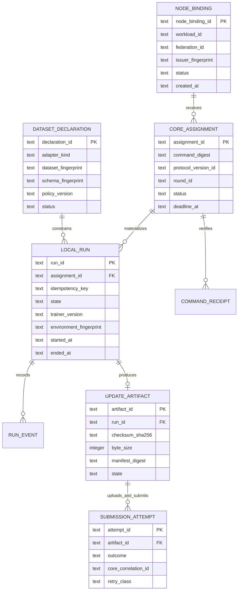
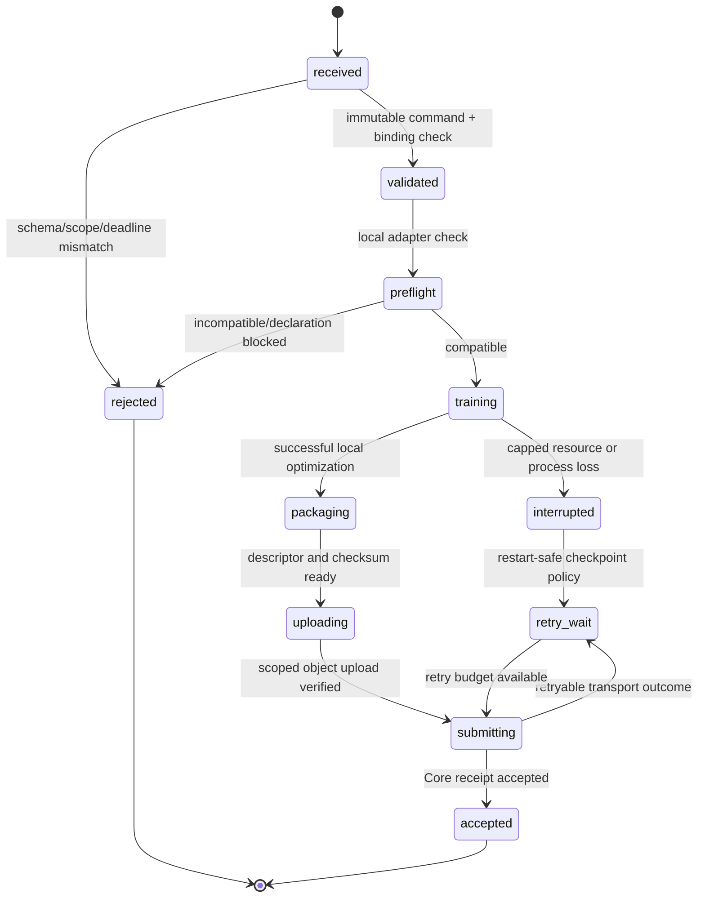

# Hospital Node Agent — Local Data and Schema Design

**Authority model:** Core owns federation/round/protocol/release authority. The Agent owns only local execution state and bounded reproducibility evidence.  
**Storage model:** Private local SQLite database for test-node control state; local training data remains outside that database and is accessed only through an allowlisted adapter.

**Implementation record — 22 August 2026:** Commit `2468f4b` uses the Node.js 22 built-in `node:sqlite` driver, avoiding a new native dependency for the synthetic test node. It creates only `local_runs` and append-only `run_events`; neither table carries a token, storage capability, byte payload, data path, dataset inventory, free-form exception, patient field, or object locator. A file-backed restart test proves that a previously accepted `(assignment_id, idempotency_key)` returns its terminal state without a second submission. The driver remains an experimental Node runtime facility, so a production-runtime support decision and a redacted status/export projection remain separate delivery gates.

## 1. Data-boundary rules

| Data class | Where it may exist | Where it must never exist |
|---|---|---|
| Local images, labels, identifiers, clinical metadata, local file paths | Institution-controlled dataset adapter and local training process only. | Agent API output, Core API, Core PostgreSQL, queue, public docs, logs, artifact manifest. |
| Base model / local update bytes | Scoped local workspace and direct Core-issued object-storage capability. | Core HTTP request body, Core database, public docs. |
| Workload credential | Runtime secret source only. | SQLite, event log, export, browser, Core database plaintext. |
| Reproducibility facts | SQLite: digests, versions, bounded metrics, state, timestamps. | Raw dataset inventory or example-level records. |
| Core command/result metadata | SQLite copy keyed by immutable digest and safe identifiers. | Editable local source of truth for protocol/round/release state. |

## 2. Logical schema

## 3. Tables and invariants

| Table | Purpose | Required fields | Invariants |
|---|---|---|---|
| `node_binding` | Local non-secret view of the active workload binding. | workload/federation IDs, issuer fingerprint, status, activated time. | One active binding; no token/client-secret column. |
| `dataset_declaration` | Local-only compatibility declaration. | adapter kind, opaque dataset/schema fingerprints, policy version, status. | No filename, sample ID, label, image, local path, or raw count stored unless protocol explicitly permits a coarsened count. |
| `command_receipt` | Immutable receipt of a Core command. | assignment ID, schema version, command digest, received/validated timestamps. | Command payload is stored only when it contains no raw data; digest must match canonical payload. |
| `core_assignment` | Local lifecycle projection. | assignment/round/protocol IDs, deadline, state. | State transitions are monotonic; terminal assignments cannot return to executable. |
| `local_run` | Idempotent local execution. | assignment ID, idempotency key, state, trainer/code/environment fingerprints. | Unique `(assignment_id, idempotency_key)`; one successful run per assignment. |
| `run_event` | Append-only safe event history. | sequence, event type, timestamp, correlation ID, safe reason code. | No free-form exception serialization or sensitive data. |
| `update_artifact` | Descriptor for bytes held outside SQLite. | checksum, size, manifest digest, state. | No storage URL/key/capability or bytes stored. |
| `submission_attempt` | Bounded remote retry evidence. | idempotency key, outcome class, Core correlation ID. | Retry only documented retryable outcomes; accepted is terminal. |

## 4. Local state machines

The Agent may retry command retrieval, short-lived capability renewal, upload, and submission only when the Core contract classifies the outcome as retryable. It must never restart training merely because a submission response is lost; it first recovers the idempotency record and reconciles the remote result.

## 5. Retention and redacted export

The initial local retention policy keeps only safe state and reproducibility facts for a short operator-configured test window. A redacted export contains assignment/run IDs, command/protocol/model/code/environment/dataset-declaration digests, state history, bounded duration/resource category, checksum, and Core correlation ID. It must omit raw provider responses, model/object locators, secrets, raw metrics arrays, source paths, and all data records.
