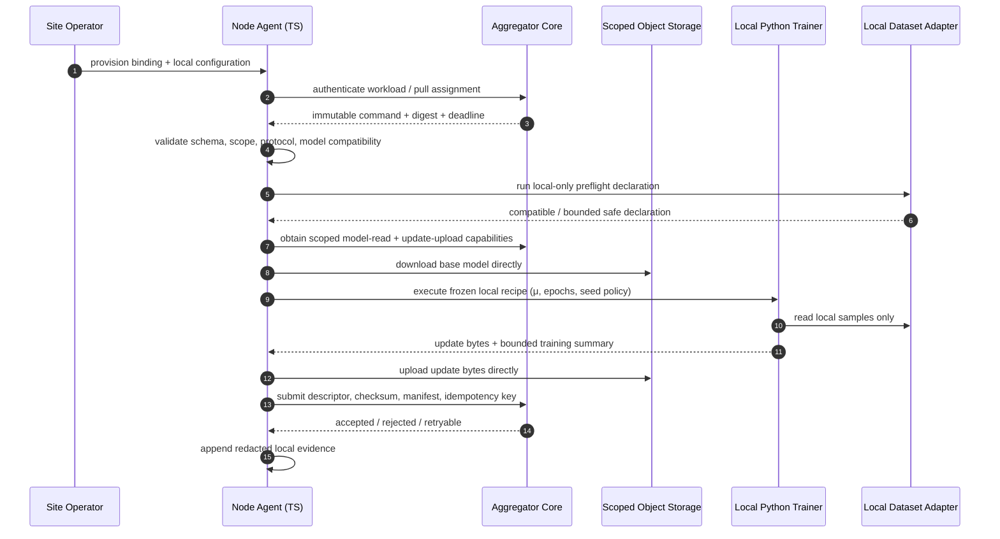
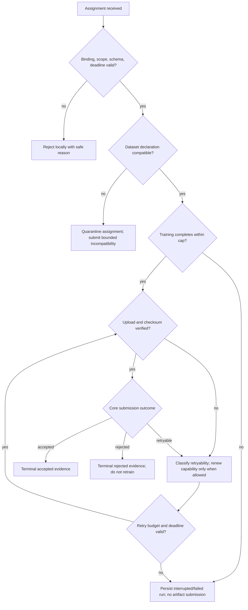
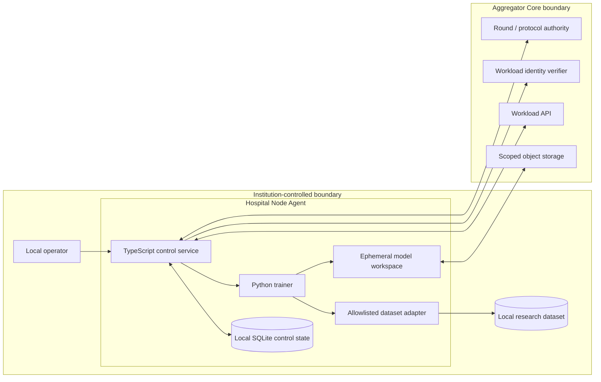

# Hospital Node Agent — Workflow and Architecture Design

## 1. Normal operation workflow

The Core is not authorized to initiate a local shell command, browse local data, or pull bytes from the Agent. The Agent does not choose an aggregation rule, alter a sealed command, approve a candidate, or publish a model. The design supports the thesis FedProx configuration by treating `μ`, local epochs, optimizer, model version, and preprocessing version as frozen command inputs.[1]

## 2. Exception workflow

## 3. Architecture

The local adapter is a strict port, not a filesystem endpoint. In v1, it supports only generated tensors and an explicit simulated public-dataset profile. Future adapters for real institutional systems must be added independently behind the same interface and cannot receive implicit network access.

## 4. Deployment topology

| Component | Network exposure | Persistent state | Lifecycle |
|---|---|---|---|
| TypeScript agent | Outbound HTTPS to the Core only; operator status bound to localhost/test private network. | SQLite control database. | Long-lived local service. |
| Python trainer | No inbound network listener. | Ephemeral workspace; optional local-safe checkpoint policy. | Spawned per validated assignment. |
| Dataset adapter | No network requirement. | Existing institution-controlled files or generated fixture. | Invoked by trainer only. |
| Object transfer | Direct signed/capability request to allowed object path. | External artifact bytes. | Time-limited capability. |

No Azure deployment is implied for the future real hospital node. The first test deployment is a **simulated site** placed in a separate Docker Compose profile, connected only to the existing private Azure Core boundary and synthetic fixtures.

## References

[1] [Thesis FedProx Methodology](https://github.com/hstu-research/thesis_breast_cancer/blob/main/result/fedprox-result/paper_sections/methodology.md)
