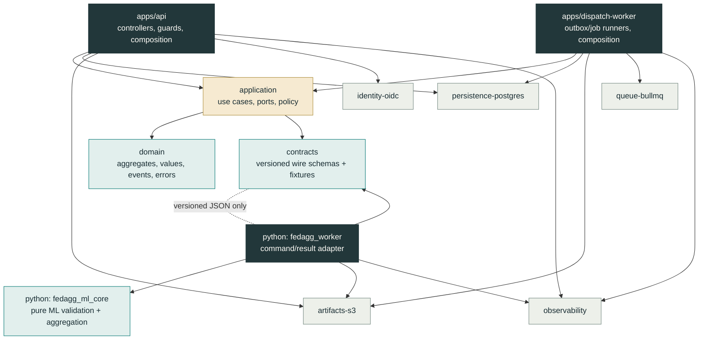
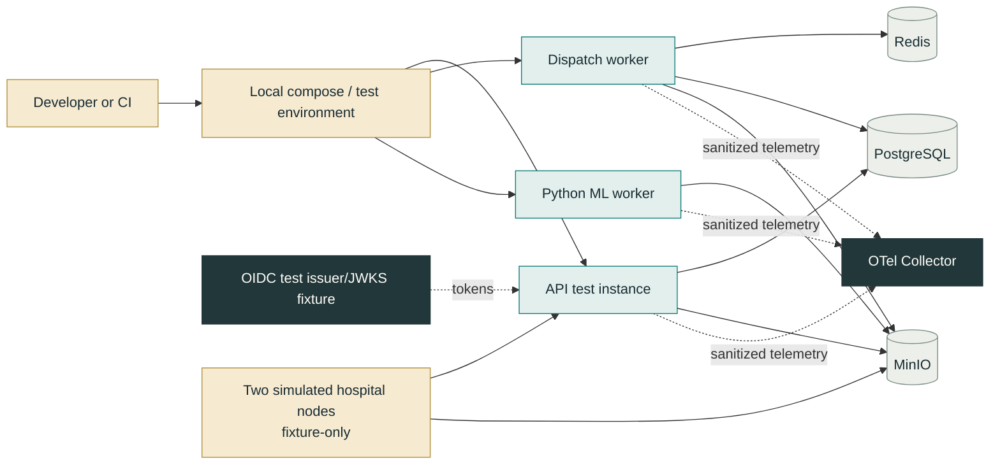

# Modular Codebase Architecture and Engineering Standards

**Status:** Research-backed engineering specification; prerequisite to scaffolding `hstu-research/federated-aggregator-core`.  
**Applies to:** The Aggregator Core only: its NestJS control plane, Node dispatch worker, Python/PyTorch ML worker, shared contracts, infrastructure, and verification harness.  
**Does not apply to:** Hospital products, hospital clinical systems, end-user portals, blockchain/IPFS, billing, or patient-data systems.

## 1. Decision summary

The Aggregator Core will be built as **one modular monorepo** with three deployable processes: a NestJS API/control plane, a Node dispatch worker, and a Python/PyTorch ML worker. The first two are TypeScript applications; the third is an independent Python package/service. They share **versioned transport contracts and test fixtures**, not runtime imports across languages.

The design is **domain-modular, ports-and-adapters disciplined, and pragmatically clean**. It is not a ceremonial implementation of “Clean Architecture,” nor a collection of tiny microservices. Business capability modules own their language, use cases, domain invariants, and ports. Frameworks, HTTP, ORM queries, Redis jobs, S3 clients, environment variables, and telemetry are adapters at the edge. A module should be easy to test without starting NestJS, PostgreSQL, Redis, object storage, or a Python process.

> **Primary rule:** A source file may depend inward on stable abstractions and domain vocabulary. It must not depend outward on an implementation detail merely because that detail is currently convenient.

This choice keeps early delivery and local integration tractable while preserving separable module boundaries. NestJS describes monorepos as a workspace approach that facilitates modular composition, shared policies, integration testing, and reuse; TypeScript project references add explicit compile-time project boundaries and incremental builds.[1] [2] The repository uses those practical tools, but module ownership—not tooling—is the actual architectural constraint.

| Concern | Standard |
|---|---|
| Primary structure | One `pnpm`/TypeScript workspace plus one Python workspace under the same repository root. |
| Deployables | `api`, `dispatch-worker`, `ml-worker`; no premature service for each noun. |
| Business organization | Package/module by capability: identity, federation, protocol, round, artifact, aggregation, model, release, audit, operations. |
| Dependency model | Domain and application ports point inward; infrastructure and transport point outward; composition roots bind them. |
| Inter-language boundary | Versioned JSON Schema/OpenAPI contracts, schema fixtures, command/result digests, and contract tests. |
| Reuse model | Reuse stable behavior and fixtures only after verification; do not import the clean-room prototype as a production dependency. |
| Code-quality model | Type-safe, small purposeful units, explicit errors, deterministic computation, reviewable changes, automated gates. |
| Test model | Fast deterministic unit tests as the base; real-adapter, contract, ML, migration, E2E, and resilience tests are focused higher layers. |

## 2. Engineering philosophy: clean code, not clean-code theatre

The project follows a **Clean Code + modular domain design** standard. “Clean code” here has a concrete operational meaning: names reveal intent, functions have one cohesive responsibility, input/output contracts are explicit, side effects are isolated, errors are classified, tests state behavior, and dependency direction protects domain policy. It does **not** mean maximizing class count, putting every line behind an interface, creating generic `BaseService` layers, or fragmenting a small application into distributed services.

### 2.1 Four non-negotiable engineering principles

| Principle | Coding consequence | Review question |
|---|---|---|
| **Capability ownership** | A round rule lives in the round module, not in a generic utility, controller, queue consumer, or SQL trigger. | Which module owns this business decision? |
| **Explicit boundaries** | Ports describe persistence, storage, clock, ID generation, queueing, and ML invocation. Adapters implement them. | Can a unit test run without the external dependency? |
| **Evidence-preserving state** | Transitions append audit/evidence; projections may update, but historical decisions are not silently overwritten. | Can this change be explained and reproduced later? |
| **Determinism by design** | Frozen commands, canonical serialization, content digests, declared environments, explicit clocks, and seeds replace ambient behavior. | Would the same approved inputs produce explainable output? |

### 2.2 What the project will not do

The codebase forbids an unrestricted `common/`, `utils/`, `helpers/`, or `shared/` dumping ground. A utility belongs either inside the capability it serves, in a named technical library with a narrow purpose, or it does not exist. It also forbids controller-to-ORM shortcuts, direct database calls from the Python worker, raw `process.env` reads outside configuration composition, `any` as an escape hatch, broad exception swallowing, and hidden network calls inside domain logic.

## 3. Repository topology

The implementation is hosted in `hstu-research/federated-aggregator-core`. The existing `hstu-research/thesis_breast_cancer` clean-room repository remains a scientific reference and fixture source. It is not imported as a production package because its scope includes hospital/admin shells and optional coordination experiments that are outside the first Aggregator Core product.

```text
federated-aggregator-core/
├── apps/
│   ├── api/                         # NestJS HTTP API + composition root
│   └── dispatch-worker/             # Node process: outbox, BullMQ, worker dispatch
├── packages/
│   ├── contracts/                   # OpenAPI, JSON Schema, generated TS types, fixtures
│   ├── domain/                      # Framework-free aggregates, values, events, errors
│   ├── application/                 # Use cases, ports, policies, command handlers
│   ├── persistence-postgres/        # SQL/ORM repositories, migrations, transaction/outbox adapters
│   ├── artifacts-s3/                # Scoped upload/download and metadata verification adapter
│   ├── queue-bullmq/                # Queue/outbox delivery adapter; no domain policy
│   ├── identity-oidc/               # Token verification and principal mapping adapter
│   ├── observability/               # Safe tracing, metrics, structured logging interfaces/adapters
│   ├── config/                      # Validated, typed configuration and startup checks
│   └── testkit/                     # Factories, fake clock/IDs, fixture readers, test containers
├── python/
│   ├── packages/
│   │   ├── fedagg_ml_core/          # Pure PyTorch aggregation/validation/reproducibility logic
│   │   └── fedagg_worker/           # Internal command handler + artifact port + result client
│   └── tests/                       # Package, contract, deterministic ML, and integration tests
├── infra/
│   ├── compose/                     # Local Postgres, Redis, MinIO, OTel Collector, test network
│   ├── migrations/                  # Database migration ownership and verification scripts
│   ├── observability/               # Collector, dashboards/alerts as code when adopted
│   └── deploy/                      # Future environment manifests; not a production claim
├── tests/
│   ├── e2e/                         # Cross-process simulated-hospital scenarios
│   ├── contract/                    # Wire-level Node/Python/public API fixture tests
│   ├── resilience/                  # Controlled interruption/retry/reconciliation tests
│   └── fixtures/                    # Non-clinical tiny models, manifests, invalid artifacts
├── docs/                            # ADRs, runbooks, API evidence, threat model, decisions
├── scripts/                         # Repeatable developer/CI commands; no business logic
├── pnpm-workspace.yaml
├── pyproject.toml                   # Python workspace/tooling coordination
├── tsconfig.base.json
├── eslint.config.mjs
├── prettier.config.mjs
├── justfile or Makefile             # Stable task aliases only
└── README.md
```

### 3.1 Why this is one repository but not one package

The NestJS API and dispatcher release on their own cadence but share contract, domain, application, configuration, and test-kit libraries. The Python worker has its own dependency resolver, runtime, packaging, static analysis, and test process. A repository-level engineering contract keeps changes to a command schema, database transition, worker result, and simulation test reviewable in one pull request. The absence of runtime cross-language imports prevents the repository from pretending that TypeScript and Python have a single type system.

Flower offers a comparable conceptual lesson: it separates long-lived communication/scheduling processes from short-lived application-specific server/client code.[3] The core borrows that separation of responsibilities while retaining its own governance control plane. OpenFL likewise distinguishes the collaborator retaining local data from the aggregator receiving model updates.[4]

## 4. Dependency architecture and module rules



The arrows point from a consumer to the thing it may import or call. The `domain` package imports nothing from NestJS, Prisma/TypeORM/Drizzle, Redis, AWS SDK, OpenTelemetry, or HTTP. The `application` package imports domain and port interfaces, not adapter implementations. The API and dispatcher are composition roots: they select adapters and inject them into use cases. The worker follows the equivalent discipline in Python.

| Layer | Allowed responsibility | May depend on | May not depend on |
|---|---|---|---|
| `contracts` | Wire schemas, canonical serialization helpers, fixture corpus, error-code vocabulary. | Small validation/serialization libraries only. | Domain services, persistence, NestJS, PyTorch. |
| `domain` | Invariants, value objects, aggregates, transition eligibility, domain events/errors. | Standard language facilities and explicitly approved small pure helpers. | Frameworks, SDKs, timestamps from system clock, random IDs, network. |
| `application` | Use-case orchestration, authorization policy calls, transaction boundaries, port invocation, outcome mapping. | Domain + contracts + port interfaces. | Concrete database, queue, storage, Nest controller/request types. |
| Adapter libraries | A specific technical integration such as Postgres, S3, BullMQ, OIDC, telemetry. | Application ports/contracts plus vendor SDK. | Another business capability’s internals. |
| Deployable app | Bootstrap, DI bindings, runtime health, transport mapping, lifecycle. | Public APIs of libraries. | Direct business-rule duplication. |
| Python core | Tensor schema checks, aggregation primitives, declared evaluation rules, reproducibility manifest. | PyTorch/Numpy and internal pure types. | HTTP server, database, Redis, raw environment lookup. |
| Python worker | Command decode/verify, artifact-port use, core invocation, result encode/send. | Python core + contracts + narrow adapters. | PostgreSQL, release approval, API controller code. |

### 4.1 Capability modules inside the control plane

The API application uses feature modules, but each is a capability boundary rather than merely an HTTP folder. NestJS modules serve composition and dependency injection; the domain/application folders remain testable without a Nest test container.

```text
apps/api/src/modules/rounds/
├── domain/                  # Round aggregate, transition and threshold rules
├── application/             # OpenRound, SealRound, AcceptSubmission use cases
├── ports/                   # RoundRepository, Clock, EventPublisher interfaces
├── infrastructure/          # Optional module-local mappings only; core adapters remain packages
├── transport/               # Controller, DTO mapper, response presenter
├── rounds.module.ts         # Nest composition for this capability
└── rounds.module.spec.ts    # Module wiring test; pure logic tests sit beside source
```

| Capability module | Owns | Must not own |
|---|---|---|
| Identity & access | Subject hydration, memberships, workload status, scopes, local authorization decisions. | External IdP administration or user interface. |
| Federation & participants | Federations, organization participation, invitation/eligibility state. | Raw hospital data or local node implementation. |
| Protocol & architecture | Immutable protocol versions, model architecture/preprocessing compatibility declarations, metric schemas. | Training execution. |
| Rounds & submissions | Round lifecycle, enrollment, intake eligibility, submission decision and quarantine. | Direct tensor deserialization. |
| Artifacts | Intent records, metadata, checksum/size/retention facts, lineage links. | Object storage bucket-wide permissions. |
| Aggregation | Frozen command creation, job lifecycle, callback reconciliation. | Numerical aggregation implementation. |
| Model & evidence | Candidate/model-version facts, evaluation evidence links, evidence completeness. | Human authorization decision. |
| Release & approval | Approval/rejection/rollback policy and immutable release package decision. | Training or object-storage validation. |
| Audit & operations | Durable audit/export/recovery records, reconciler policy, incident linkage. | Rewriting business history. |

No module imports another module’s `infrastructure/`, controller, repository implementation, private class, or test fixture. Cross-capability interaction is through a public application interface or an explicit domain/application event. A module cannot create “just one query” against another module’s tables; it requests a read model or receives a purpose-built query port.

## 5. Contract-first coding between TypeScript and Python

The most important seam in the system is not a folder; it is the Aggregation Command / Worker Result contract. It is defined once in `packages/contracts`, represented as versioned JSON Schema and OpenAPI components, and materialized into TypeScript and Python models with generated or verified bindings. The canonical JSON representation is hashed before a job is dispatched. The worker echoes the digest in its result; the control plane accepts no result that fails identity, job, attempt, schema, and digest checks.

| Contract family | Source of truth | TypeScript use | Python use | Required verification |
|---|---|---|---|---|
| Public HTTP API | OpenAPI 3.1 components under `contracts/openapi/` | DTO mapping and generated clients only where useful. | Test fixture consumer only. | OpenAPI schema validation and HTTP contract tests. |
| Internal worker API | JSON Schema under `contracts/worker/v{n}/` | Command producer/result validator. | Command/result models and validators. | Golden fixtures in both languages, backwards-compatibility test. |
| Domain event envelope | JSON Schema under `contracts/events/v{n}/` | Outbox dispatcher/consumer validation. | Not imported unless a future worker consumes it. | Schema tests and idempotency/dedupe test. |
| Error codes | Versioned typed registry | Safe HTTP presentation and audit/metric classification. | Classified worker results. | Exhaustiveness/type-level tests. |
| Reproducibility manifest | JSON Schema under `contracts/evidence/v{n}/` | Evidence linkage validation. | Worker emission. | Golden manifest and required-field tests. |

Schema changes are additive by default. A breaking change increments a major contract version, introduces an explicit compatibility window, updates golden fixtures, and requires API/worker/dispatch compatibility tests in the same pull request. Database types and ORM entities are not transport contracts; transport models are never passed directly into domain aggregates without a mapper.

## 6. Reuse policy: preserve evidence, not accidental coupling

The clean-room repository has valuable tested work, but reuse is evaluated component by component. It is a reference repository, not the source tree of the product core.

| Existing asset | Decision | Reuse method | Required work before adoption |
|---|---|---|---|
| `ml/src/federated_core.py` FedAvg/FedProx primitives | **Adapt after verification** | Port into `python/packages/fedagg_ml_core` with preserved behavioral test cases. | Establish serialization policy, explicit non-floating-buffer handling, richer result types, resource limits, package layout, and reproducibility evidence. |
| `ml/tests/test_federated_core.py` | **Reuse as a behavior fixture** | Translate assertions into the new Python package test suite before refactor. | Add property tests, contract fixtures, malformed artifact tests, and architecture-specific BatchNorm policy tests. |
| Aggregator service shell/state transitions | **Reuse as reference behavior only** | Encode valid/invalid transition examples in the new domain tests. | Replace Express/in-memory maps with nested capability modules, database transactions, audit/outbox, identity, idempotency, and typed errors. |
| Hospital/admin service shells | **Do not import** | Retain as research reference. | Out of first-product scope. |
| Integration test shell | **Reuse scenarios, not code** | Rebuild as two simulated workload nodes talking to real local dependencies. | Add contract, storage, queue, worker, and recovery controls. |
| Blockchain/IPFS contracts | **Defer** | Preserve only provenance/ADR link. | Must not become a dependency of the core release path. |

This policy prevents false efficiency. Copying a small test-proven primitive and proving it in its new package is faster and safer than forcing a research monorepo package into a production core dependency graph. Conversely, rewriting behavioral fixtures without preserving their intent risks reintroducing the exact aggregation defects the clean-room program was designed to uncover.

## 7. Code conventions

### 7.1 TypeScript and NestJS standard

TypeScript runs in full strict mode with `noUncheckedIndexedAccess`, `exactOptionalPropertyTypes`, and `noImplicitOverride` enabled where compatible. Project references enforce the declared workspace graph. Vendor/framework types stop at an adapter or transport mapper. NestJS is used for controllers, guards, modules, dependency injection, lifecycle, request validation, and test composition; it is not the domain model.

Nest provides isolated class tests, DI-module test composition, provider overrides, and application-level end-to-end testing.[5] Incoming DTOs are globally validated with a strict allow-list configuration; unknown properties are rejected, rather than silently ignored, for mutation commands.[6]

| Rule | Required practice | Prohibited shortcut |
|---|---|---|
| Naming | Name by domain intent: `SealRound`, `AcceptedSubmission`, `ArtifactIntegrityMismatch`. Use verbs for commands and predicates, nouns for values. | `handle`, `process`, `data`, `misc`, `helper`, or generic `Manager` without domain meaning. |
| Functions | One cohesive decision; explicit input/output; prefer pure functions for policy. | A controller that validates, calls ORM, computes state, queues work, and formats errors. |
| Types | `unknown` at untrusted boundaries, parse once, then use discriminated unions/value objects. | `any`, type assertions to silence compiler errors, `Record<string, unknown>` as a permanent model. |
| Errors | Expected domain failures use typed result/error codes; adapters throw only technical exceptions that are mapped at the boundary. | Catch-all `try/catch` returning `false`, raw stack/error to client, or string matching for domain logic. |
| Time/IDs/randomness | Inject `Clock`, `IdGenerator`, and deterministic seed providers through ports. | `Date.now()`, `Math.random()`, UUID generation inside domain transitions. |
| Transport | Map request DTO → command → use case → presenter. | Passing `Request`, ORM entity, or DTO through business logic. |
| Persistence | Repository returns domain models/read projections; transaction wrapper owns atomic state/audit/outbox commit. | SQL/ORM calls from controllers/use cases without port/transaction boundary. |
| Configuration | Validate at startup and inject typed namespaced config. | Scattered direct `process.env` reads or committed secret files. |
| Logging | Structured, redacted, correlation-linked event logs. | Logging artifacts, credentials, raw manifests, patient-oriented metadata, or unbounded payloads. |

### 7.2 Python/PyTorch standard

The Python workspace uses `pyproject.toml`, a `src/` layout, isolated environments, strict pytest configuration, Ruff formatting/linting, a type checker such as mypy or pyright, and locked dependencies. pytest recommends an installed/editable `src` layout and documents strict test configuration for new projects.[7]

| Rule | Required practice | Prohibited shortcut |
|---|---|---|
| Package shape | `fedagg_ml_core` contains pure numeric/domain-neutral functions; `fedagg_worker` owns ports and command handling. | Importing HTTP, SQL, Redis, or Nest-only models from ML core. |
| Tensor validation | Validate artifact digest/descriptor before load; then keys, shapes, dtypes, finiteness, architecture, and declared policy. | Trusting client-declared architecture or calling `torch.load` on unbounded/unverified input. |
| Determinism | Explicit algorithm policy, order, seed handling, environment manifest, and serialization/version declaration. | Ambient random seed, unordered input maps, implicit device choice. |
| Exceptions | Return a typed classified result for expected invalid inputs; reserve exceptions for unexpected technical faults. | Bare `except`, swallowed numerical failure, or a generic `False`. |
| Side effects | Artifact readers/writers and result clients implement narrow ports. | Accessing bucket-wide credentials or database directly from aggregation code. |
| Performance | Record durations/resources safely; add limits before accepting larger artifacts. | Premature parallelism or GPU dependency before a reproducible baseline. |

### 7.3 Configuration, secrets, and feature flags

Configuration is environment-supplied and schema-validated at startup. NestJS documentation recommends external environment configuration, supports typed/namespaced configuration, and supports startup validation.[8] Local `.env.example` files enumerate non-secret variable names and safe development defaults; actual `.env` and production credentials are ignored by Git. The worker obtains only the short-lived credentials and allow-listed artifact grants required for its command.

Feature flags are narrow, named, default-safe, and temporary. A flag controls a deployable behavior such as an alternate evaluation adapter; it does not bypass authorization, integrity checks, validation, or release approval. Every flag has an owner, expiry/removal issue, test coverage for enabled/disabled behavior, and a documented default.

## 8. Supplementary services and local developer topology

Supplementary services are selected because the core needs a faithful boundary test—not because every engineering concern should become a platform.

| Service/tool | Local role | Production-candidate role | Required from first vertical slice? |
|---|---|---|---|
| PostgreSQL | Real schema/migration/repository/outbox testing. | Domain source of truth. | Yes. |
| Redis | BullMQ queues, locks, delayed retries, worker heartbeat simulation. | Durable coordination dependency. | Yes for dispatch slice. |
| MinIO/S3-compatible store | Signed intent, metadata, checksum, candidate/evidence artifact integration. | S3-compatible private object storage. | Yes for artifact slice. |
| OIDC test issuer/JWKS fixture | Human/workload token verification tests without real credentials. | External managed IdP. | Yes for identity slice. |
| OpenTelemetry Collector | Local redaction, trace propagation, metric/log shape verification. | Telemetry pipeline. | Yes for observability slice; minimal config first. |
| Testcontainers/Docker Compose | Ephemeral local/CI integration dependencies. | Not a production runtime component. | Yes. |
| Toxiproxy or controlled fault adapter | Simulate storage/queue/worker outages and timeouts. | Not a runtime component. | Add before resilience gate. |
| Prometheus/Grafana | Optional local visual debugging. | Chosen monitoring backend or compatible service. | Defer until emitted metrics are stable. |
| Flower adapter | Optional future worker-side FL runtime adapter. | Optional. | Explicitly deferred. |



## 9. Testing strategy and scientific verification ladder

The test suite is layered by the failure it is designed to catch. It is not a coverage-percentage competition. NestJS explicitly supports isolated tests, test modules with provider overrides, and E2E application tests; the project uses all three selectively.[5] Large end-to-end tests remain few because they are slower and less diagnostic than focused lower-layer tests.[9]

| Layer | Runs against | Primary examples | Gate |
|---|---|---|---|
| Static checks | Source only | TypeScript composite build, lint, format, Python lint/type check, dependency/license/secret scan. | Every change. |
| Unit/domain | Pure functions/aggregates/fakes | Round transition matrix, threshold policy, idempotency semantics, release eligibility, canonical command digest. | Every change; deterministic and fast. |
| ML unit/property | Pure Python tensors/fixtures | One-client identity, weighted-average hand calculation, FedProx `mu=0` equivalence, order invariance where policy allows, incompatible state rejection. | Every ML or contract change. |
| Module/application | Nest test module with overridden ports | Authorization policy, command handler outcomes, outbox generated in same transaction intent. | Every capability change. |
| Adapter integration | Ephemeral Postgres/Redis/MinIO/OIDC fixture | Migration/repository behavior, signed intent scope, object verification, queue retry/reconciliation. | Every adapter/migration change. |
| Contract | JSON Schema/OpenAPI and golden fixtures in both languages | Aggregation command, worker result, error code, evidence manifest compatibility. | Every schema change; required before merge. |
| E2E simulation | All local processes + two simulated nodes | Create protocol/round, submit artifacts, validate, aggregate, attach evidence, approve/publish, download released model. | Main branch and release candidate. |
| Resilience/security | Controlled faults/negative credentials | Redis restart, worker callback duplicate, storage timeout, expired intent, wrong scope, oversize/malformed artifact. | Main branch; focused change paths. |
| Reproducibility/regression | Versioned tiny fixture corpus | Same command/environment has matching output digest or approved numerical tolerance/evidence explanation. | ML/release-candidate gate. |

### 9.1 Test data policy

No patient images, patient identifiers, or production model artifacts enter unit or CI fixtures. The test corpus uses tiny synthetic tensors, intentionally invalid payloads, anonymous model metadata, mocked OIDC subjects, and explicitly licensed public-data manifests only where approved research integration demands it. Artifacts must be small enough for review and checksum-addressable in Git or generated reproducibly by a fixture script.

### 9.2 Deterministic ML acceptance tests

The existing clean-room `federated_core.py` tests are a starting behavior record, not a sufficient production proof. The new ML suite must include the following before integrating any vision architecture:

| Invariant | Required assertion |
|---|---|
| One-client identity | The aggregate equals the only accepted compatible update exactly for declared floating-tensor policy. |
| Weighted-average correctness | A hand-computable two-client case uses declared positive sample counts and matches expected values. |
| FedProx boundary | `mu=0` reduces the client proximal helper to ordinary local loss; server aggregation remains separately named. |
| Rejection | Missing keys, extra keys, shape/dtype mismatch, NaN/Inf, invalid sample count, base-model mismatch, and architecture mismatch fail with classified evidence. |
| Input freeze | A retry uses the same ordered accepted descriptors and command digest; late submissions cannot enter. |
| Serialization | Artifact checksum and declared format must match before deserialization; unsafe/unbounded loads are rejected. |
| Reproducibility | A declared environment/seed/model fixture emits a stable evidence manifest and documented numerical tolerance. |

## 10. CI, quality gates, and review discipline

Every pull request runs checks affected by its dependency graph. Main branch runs the full integration/resilience matrix on a controlled schedule or after an approved merge; release tags require an evidence bundle. Required gates are scripted rather than remembered.

| Gate | Tooling direction | Blocks merge when |
|---|---|---|
| Workspace integrity | `pnpm install --frozen-lockfile`, Python lock sync, project-reference build | Lockfiles, package graph, or generated contract artifacts drift. |
| Style & static analysis | ESLint/Prettier, Ruff, mypy/pyright | Formatting, unsafe pattern, type, or lint rule fails. |
| Tests | Vitest/Jest, pytest, integration compose/testcontainers | Relevant layer is red, flaky, or skipped without documented approval. |
| Contract compatibility | OpenAPI/JSON Schema validation + golden fixture corpus | Node/Python/public contract changes without a version/fixture/migration plan. |
| Migration verification | Ephemeral empty DB and prior-version upgrade DB | Migration does not apply, rollback/reconciliation policy is absent, or data invariants fail. |
| Security hygiene | Secret scan, dependency audit, container scan, license policy as configured | Credential, disallowed dependency, critical vulnerability, or unsafe artifact path appears. |
| Architecture rule check | Import boundary lint/dep-cruiser equivalent + review checklist | A domain/application module imports an adapter/framework or reaches another capability’s private internals. |
| Documentation evidence | ADR/release/contract documentation check | A behavior/protocol/contract decision has no ledger update. |

Code review must answer specific questions, not merely approve code style: What capability owns the behavior? Which contract changed? What failure mode is introduced or removed? Which test proves it? Are logs/audit outputs safe? Is the change reproducible? Does it affect scientific evidence, release governance, or raw-data boundaries? A reviewer may request a smaller change whenever a pull request mixes refactoring, behavior change, schema evolution, and infrastructure movement without separable evidence.

## 11. First scaffold sequence

| Slice | What is created | What proves it |
|---:|---|---|
| 0 | Repository policy, workspace roots, TypeScript references, Python `src` packages, lint/type/test scripts, CI skeleton. | Empty clean checkout runs the static-quality suite. |
| 1 | `contracts`, `domain`, `application`, `config`, `testkit`; identity/federation/protocol/round capability skeletons. | Pure round/protocol transition tests pass without Nest or database. |
| 2 | Nest API composition, strict input validation, OIDC fixture adapter, Postgres migrations/repositories, audit/outbox transaction. | Authorization and state/audit/outbox integration scenario passes. |
| 3 | MinIO artifact intent and verification adapter; worker command/result schemas and golden fixtures. | Scope/checksum/manifest/quarantine tests pass against real local storage. |
| 4 | Python ML core/worker and Node dispatcher. | Frozen command → validated aggregate → candidate result contract succeeds with synthetic tensors. |
| 5 | Evidence/release/rollback modules and simulated two-hospital E2E harness. | Approved candidate publishes; rollback preserves history and stops future distribution. |
| 6 | Resilience, telemetry, operational runbooks, performance baselines. | Controlled interruption cannot silently duplicate, lose, or alter a scientific input set. |

## 12. Explicit decisions requiring approval before scaffold

1. Confirm the repo split: `federated-aggregator-core` is a new product-core repository; `thesis_breast_cancer` remains a clean-room reference/fixture repository.
2. Confirm the primary implementation form: modular monolith control plane plus dispatch worker, not microservices; Python worker is a separately deployed computation boundary.
3. Confirm the preferred TypeScript persistence/migration tool after a short proof-of-concept, while retaining the repository/transaction/outbox port boundary.
4. Confirm the Python toolchain lock strategy (`uv`/`pyproject` recommended) and strict type-checker choice.
5. Confirm canonical JSON/digest rules, worker contract versioning, and generated-versus-verified model bindings.
6. Confirm the first CI-provider configuration, protected-branch checks, and whether controlled integration dependencies run on every pull request or in a required merge queue.

## References

[1] NestJS. “Workspaces.” https://docs.nestjs.com/cli/monorepo

[2] TypeScript. “Project References.” https://www.typescriptlang.org/docs/handbook/project-references.html

[3] Flower Labs. “Flower Architecture.” https://flower.ai/docs/framework/explanation-flower-architecture.html

[4] OpenFL. “Overview.” https://openfl.readthedocs.io/en/latest/

[5] NestJS. “Testing.” https://docs.nestjs.com/fundamentals/testing

[6] NestJS. “Validation.” https://docs.nestjs.com/techniques/validation

[7] pytest. “Good Integration Practices.” https://docs.pytest.org/en/stable/explanation/goodpractices.html

[8] NestJS. “Configuration.” https://docs.nestjs.com/techniques/configuration

[9] Google Testing Blog. “Just Say No to More End-to-End Tests.” https://testing.googleblog.com/2015/04/just-say-no-to-more-end-to-end-tests.html
