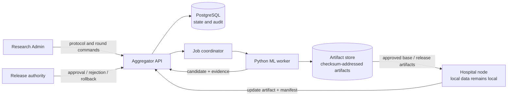
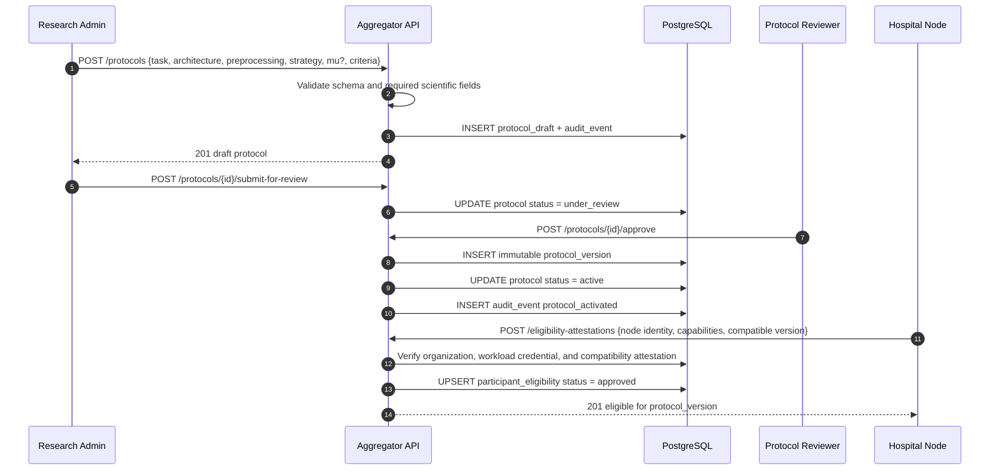
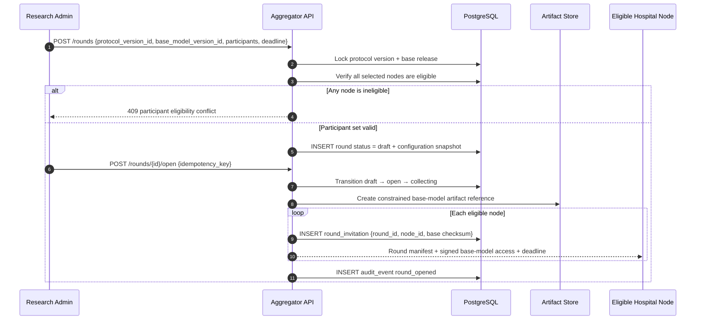
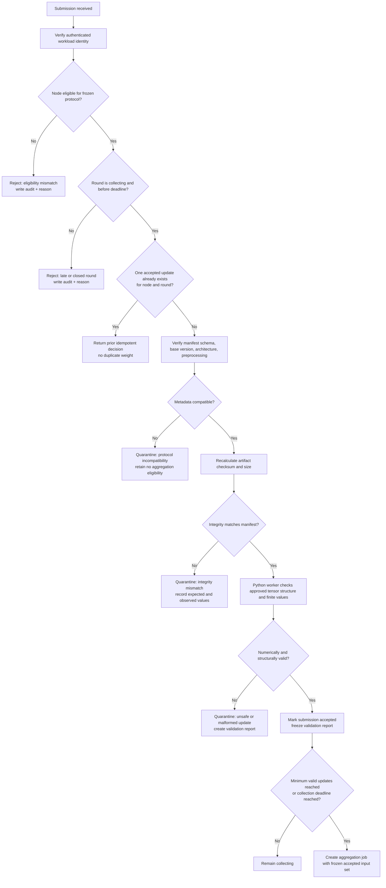
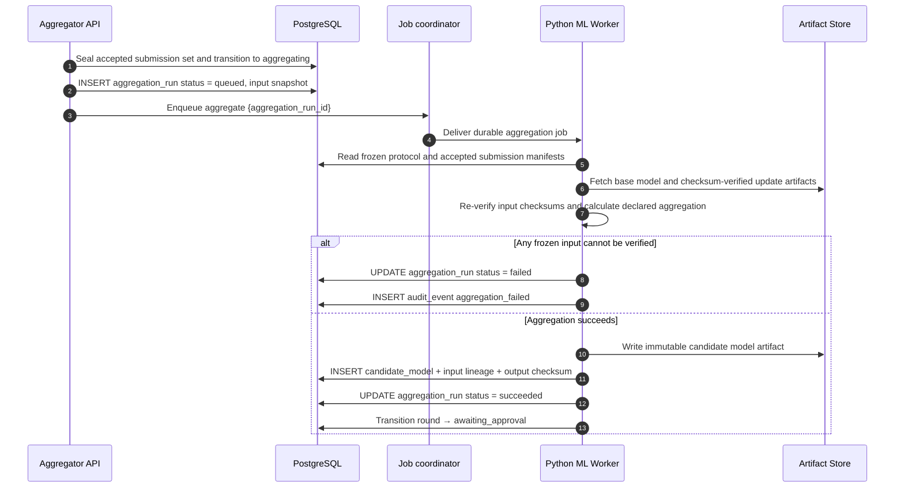
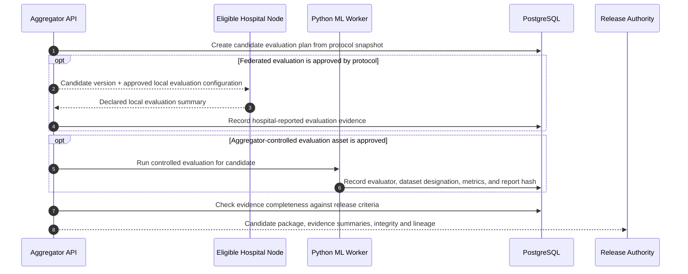
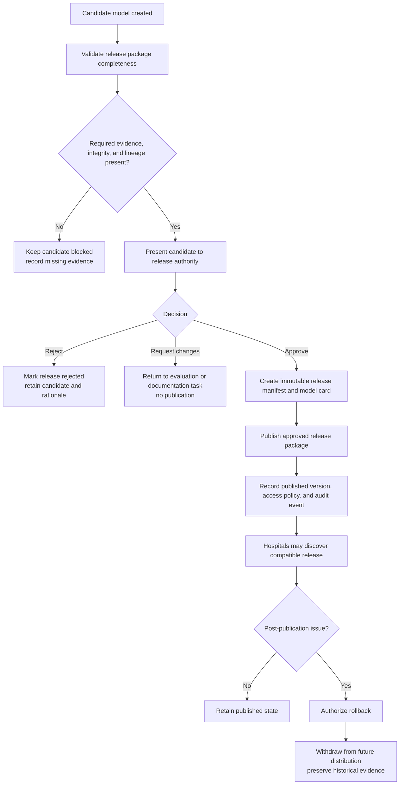
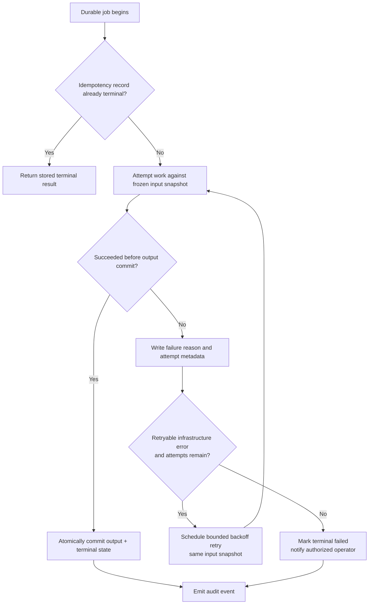
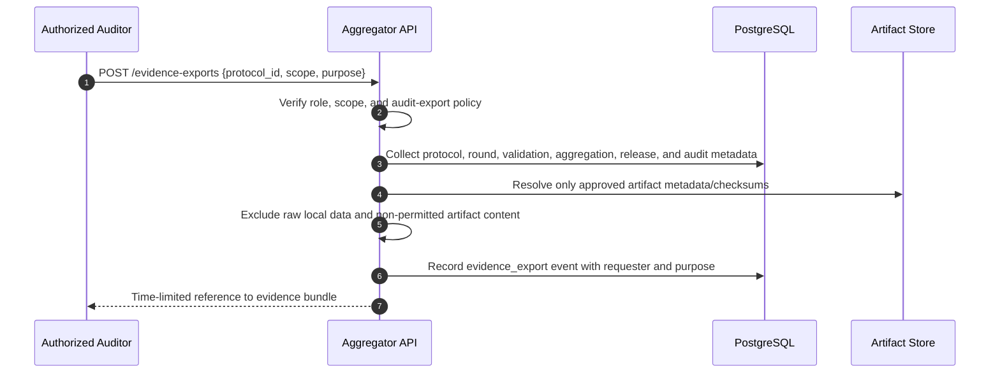

# Workflow Design and Orchestration

## Purpose and boundary

This chapter defines the **Aggregator Core workflow** for a research-stage, multi-hospital federated-learning program in breast-cancer histopathology. It describes the central control plane that registers eligible hospital nodes, freezes research protocols, coordinates federated rounds, validates submitted model-update artifacts, invokes canonical aggregation and evaluation work, and publishes only reviewed model releases.

The workflow is deliberately narrower than a hospital application. A hospital owns its local data preparation, local data governance, local runtime, and client-side model training. The Aggregator Core receives only approved **model update artifacts**, integrity metadata, declared training configuration, and permitted summary metrics. It must not ingest raw image tiles, whole-slide images, patient identifiers, direct clinical records, or a hospital’s local dataset. This division follows the central federated-learning pattern in which a global model is distributed to clients, clients train on their own data, and model updates are returned for server-side reconciliation rather than centralizing the original datasets.[1]

> **Research release boundary.** A published version is a controlled research artifact. It is not a clinical deployment, a diagnostic claim, or evidence of regulatory approval.

## 1. Workflow actors and durable records

The design separates authority from computation. The TypeScript control plane owns authorization, immutable state transitions, idempotent command handling, audit events, and release governance. The Python/PyTorch worker owns numerical inspection, aggregation, and evaluation computations. The artifact store holds large, checksum-addressed binaries; PostgreSQL is the durable system of record for state and provenance.

| Actor or component | Responsibility | Durable records created or updated | Never receives |
|---|---|---|---|
| Research Admin | Proposes protocols, opens/cancels rounds, reviews evidence. | Protocol draft, approval request, round command, audit event. | Raw hospital images or patient data. |
| Release Authority | Approves, rejects, or rolls back a candidate release. | Release decision, review rationale, audit event. | Hospital-local datasets. |
| Aggregator API | Enforces identity, protocol/round rules, idempotency, and state transitions. | Organization/node eligibility, submission receipt, validation task, state transition. | Tensor computation responsibility or raw data. |
| Job coordinator | Delivers durable validation, aggregation, evaluation, and notification jobs. | Job attempt, retry schedule, terminal failure record. | Final authority to publish a release. |
| Python ML Worker | Parses approved artifacts, validates model structure, aggregates, and evaluates. | Validation report, aggregation run, candidate metadata, evaluation report. | Human approval authority. |
| Artifact store | Stores model checkpoints and manifests behind checksum verification. | Immutable object version, checksum/size reference. | Permission to define a scientific protocol. |
| Hospital Node | Trains locally against the frozen protocol and submits an update envelope. | Local-only training log; externally, declared update manifest. | Other hospitals’ data, updates, or private metrics. |



## 2. State vocabulary and invariants

The workflow uses explicit states rather than inferring scientific status from the existence of files. A single update upload cannot create a release, an aggregation output cannot overwrite a previous candidate, and a candidate cannot be published without a recorded release decision. Each command includes an idempotency key; a retry may return the prior result but must not duplicate a submission, aggregation weight, or release.

| Domain object | Core states | Invariant that prevents unsafe progression |
|---|---|---|
| Protocol | `draft → under_review → active → retired` | An active version is immutable. Parameter changes create a new protocol version. |
| Participant eligibility | `pending → approved → suspended → withdrawn` | A node is eligible only when its organization, workload credential, compatibility attestation, and protocol approval are active. |
| Round | `draft → open → collecting → validating → aggregating → awaiting_approval → published/closed` | Only a frozen protocol version and single base model version can be attached to a round. |
| Submission | `received → validating → accepted` or `rejected/quarantined` | At most one accepted submission exists for one `round_id + node_id`. |
| Aggregation run | `queued → running → succeeded` or `failed` | Inputs are frozen by accepted-submission identifiers and checksums before numerical work begins. |
| Model release | `candidate → validated → approved → published` or `rejected/rolled_back` | Publication requires an accountable approval event and package-completeness checks. |

## 3. Protocol activation and participant eligibility

A protocol begins as a formal research contract. It records the task, model architecture and tensor layout identifiers, preprocessing contract, aggregation rule, declared client-local optimization strategy, FedProx `mu` when applicable, permitted metrics, expected sample-count semantics, minimum accepted-update threshold, collection deadline, evaluation plan, and release criteria. Once a review authority activates the protocol, the core materializes an immutable `protocol_version` and links every later round, submission, aggregation run, candidate, and release to it.

FedProx is retained as a client-local training declaration. The original FedProx framing and its common baseline use an SGD optimizer with a proximal term controlled by `mu`; it treats heterogeneity as a local optimization concern and generalizes FedAvg.[3] Therefore, the central service records the declared `strategy_id` and `proximal_mu`; it does not label a server averaging calculation as FedProx solely because client weights were averaged.



| Eligibility check | Evidence required | Failure handling |
|---|---|---|
| Organization approval | Active organization record and human governance approval. | Keep participant pending or suspend participation. |
| Node identity | Separate workload credential bound to organization/node identity. | Reject request before protocol details or artifacts are exposed. |
| Compatibility | Supported architecture, preprocessing schema, artifact format, and protocol version. | Mark incompatible; require a new attestation after correction. |
| Research agreement | Active scope/data-use acknowledgement appropriate to the program. | Do not select the node for a round. |
| Operational readiness | Declared capacity and version readiness, without sending local data. | Permit later rounds only after readiness is re-established. |

## 4. Round launch and base-model distribution

Round creation is a controlled command, not a scheduled file copy. The Aggregator API selects the active protocol version and a single approved base model release. It creates an initial `draft` round, checks the proposed participant set against eligibility at that moment, and records a protocol/configuration snapshot. Opening a round yields time-limited, checksum-bound access to the base model package and records an invitation for each node. A node cannot start with a model that differs from the round’s `base_model_version_id`.



The base-model manifest must include the round identifier, protocol version, model architecture/checkpoint format, preprocessing version, artifact checksum and byte size, strategy declaration, client hyperparameter envelope, permitted metrics schema, and collection deadline. The hospital node should record the received checksum locally before use. The core records that the artifact was issued; it does not receive a hospital data inventory or local sample contents.

## 5. Hospital-local training and submission intake

The hospital node performs local preparation and training inside its own environment. For FedAvg, it follows the declared local optimizer/training schedule. For FedProx, it follows the same frozen protocol plus the declared proximal configuration. The node then submits a **model update artifact** with an update manifest. The artifact can represent a full compatible state dictionary or a defined delta representation, but the protocol must name the representation. It must never be treated as a raw-data transport channel.

```mermaid
sequenceDiagram
  autonumber
  participant Node as Hospital Node
  participant Local as Local Training Runtime
  participant API as Aggregator API
  participant DB as PostgreSQL
  participant Store as Artifact Store
  participant Queue as Validation Queue

  Node->>Local: Verify base checksum; train on local permitted dataset
  Local->>Local: Apply declared FedAvg or client-side FedProx objective
  Local->>Local: Create update artifact + manifest + checksum
  Node->>API: POST /rounds/{id}/submissions {manifest, idempotency_key}
  API->>DB: Verify node eligibility and round collecting state
  API->>DB: Check round_id + node_id uniqueness / idempotency
  alt Duplicate accepted request
    API-->>Node: 200 existing submission decision
  else Eligible new request
    API->>Store: Issue one-use upload reference scoped to submission ID
    Node->>Store: PUT update artifact
    Node->>API: POST /submissions/{id}/complete {checksum, byte_size}
    API->>DB: INSERT submission status = received
    API->>Queue: Enqueue validation {submission_id}
    API-->>Node: 202 accepted for validation
  end
```

| Submission-manifest field | Purpose | Privacy / integrity rule |
|---|---|---|
| `round_id`, `protocol_version_id`, `node_id` | Establishes authorized context. | Must match an active invitation and workload credential. |
| `base_model_version_id` | Proves common starting point. | Must equal the round’s immutable base. |
| `architecture_id`, `preprocessing_version`, `update_format` | Supports compatible parsing and aggregation. | No free-form code or unrecognized serializer. |
| `artifact_checksum`, `byte_size`, `artifact_uri` | Establishes verifiable artifact identity. | URI is a locator, not proof; checksum is recalculated. |
| `declared_examples` | Supports protocol-defined weighting or reporting. | Count semantics are defined by protocol and never substitute for dataset access. |
| `local_strategy`, `proximal_mu` | Preserves FedAvg/FedProx provenance. | Must be allowed by the frozen protocol; no server inference. |
| `permitted_metrics` | Carries declared local summaries. | Label as hospital-reported; suppress prohibited granularity. |

## 6. Validation, acceptance, and quarantine

Validation has two layers. The control-plane layer establishes authorization, state, schema, idempotency, artifact binding, and deadline conditions. The Python worker then inspects the artifact with a protocol-approved safe parser and checks shape, tensor names, expected dtypes, finite numeric values, base/architecture compatibility, and declared byte/checksum identity. The worker’s validation report is evidence, not an implicit release decision.



| Validation outcome | Round effect | Submission effect | Required evidence |
|---|---|---|---|
| Accepted | May count toward threshold. | Immutable accepted decision. | Validation report, checksum verification, compatibility result. |
| Rejected | Does not count toward threshold. | Terminal reason visible to authorized node/admin. | Reason code, actor/system timestamp, audit event. |
| Quarantined | Does not count; requires investigation or corrected resubmission. | Artifact remains access-restricted and excluded. | Observed incompatibility/integrity/numeric report. |
| Duplicate | Does not count again. | Return original accepted/rejected decision. | Idempotency key and original submission linkage. |
| Late | Does not reopen a sealed set. | Terminal reason; possible future-round participation. | Round state/deadline snapshot. |

## 7. Aggregation, candidate creation, and evaluation

When collection closes with a protocol-compliant accepted set, the core moves the round to `aggregating` and emits one aggregation job. The job payload freezes the protocol snapshot, ordered accepted submission identifiers, each verified artifact checksum, base model identifier, declared aggregation rule, and a deterministic output namespace. The worker creates an aggregation run that cannot silently add or remove an input after execution begins.

For the initial research product, weighted FedAvg is the canonical server aggregation baseline when allowed by the protocol: updates are weighted by the declared, protocol-defined local-example value. The aggregator records any FedProx declaration in the inputs and candidate lineage, but `mu` is not an extra server weight. Alternatives such as robust aggregation, secure aggregation, or differential privacy are future protocol capabilities; they must not be implied by this workflow until a formally versioned implementation exists.



Evaluation then attaches evidence to the candidate without overwriting local metrics. Federated/client-side evaluation evaluates global parameters on locally held data; centralized/server-side evaluation is a separate process applied by a server evaluation function after aggregation.[2] The core will model these as separate evidence classes, with distinct ownership, dataset/protocol designation, and result provenance.



## 8. Governance approval and model-release workflow

Release is a governance action following candidate/evidence completion. The release authority cannot approve an incomplete package, and the API cannot publish a release simply because an aggregation job succeeded. An approved release bundle contains the immutable model artifact and checksum, base/candidate lineage, protocol version, compatibility data, evaluation evidence with clear labels, model card, release notes, known limitations, and a human decision record.



## 9. Exceptions, retry controls, and containment

Research workflow safety depends on treating exception paths as first-class states. The table below specifies minimum containment behavior; exact retry counts and alert routing remain implementation configuration and must be documented with the deployment.

| Event | Safe system response | Not permitted |
|---|---|---|
| Node submits a duplicate request | Return previous decision by idempotency key and unique `round_id + node_id` constraint. | Count the same contribution twice. |
| Collection deadline expires | Seal the input set; aggregate only if the protocol’s threshold is met, otherwise close/cancel with reason. | Accept a late update into a sealed aggregation run. |
| Fewer valid updates than required | Close or cancel the round and create an evidence record explaining why. | Lower threshold invisibly or aggregate an inadequate set. |
| Worker error before candidate commit | Retry the durable job only against the same frozen input snapshot. | Recompute with a mutated or newly received input set. |
| Checksum/tensor incompatibility | Quarantine and exclude artifact; permit corrected resubmission only while the round remains open. | Aggregate an unverifiable or unsafe artifact. |
| Evaluation evidence incomplete | Block approval with clear missing-evidence record. | Publish a candidate because a model artifact exists. |
| Published release later found unsuitable | Create approved rollback; stop future distribution, preserve history. | Delete the audit trail or rewrite a previous decision. |
| Participant withdrawal | Suspend future invitations and preserve protocol-defined historical evidence. | Claim retroactive deletion of already aggregated numerical influence without a defined unlearning protocol. |



## 10. Withdrawal, audit, and evidence export

The core must make a distinction between future participation and historical research evidence. Withdrawal or suspension prevents a node from being selected for future rounds. It does not fabricate an ability to remove a participant’s already aggregated numerical contribution from an existing model artifact. Any such “machine unlearning” claim would require a separately designed, validated protocol and is not in scope for the first product.

An authorized evidence export contains no raw hospital data. It records the protocol version, eligibility decisions, round timeline, invitations, submission decision summaries, validation reports, aggregation input/output checksums, candidate/release lineage, evaluation-evidence labels, human approvals, rollback records, and retention/deletion markers. The export’s access is governed as a research audit object.



## 11. Requirements traceability

| Requirement or research concern | Workflow control | Evidence record |
|---|---|---|
| No raw patient data in core | Artifact/manifest allow-list, external hospital boundary. | Submission manifest schema and audit events. |
| Reproducible aggregation | Frozen protocol, base model, accepted input set, checksums, deterministic run. | `aggregation_run`, input/output checksums, worker report. |
| FedProx scientific accuracy | Client-local strategy declaration and `mu` provenance. | Protocol snapshot and submission manifest. |
| Heterogeneous hospital compatibility | Versioned model, preprocessing, serializer, and capability attestation. | Eligibility and validation reports. |
| Safe model release | Candidate/evaluation/review/publication separation. | Release decision, model card, release manifest. |
| Operational recovery | Idempotent commands, durable job attempts, frozen inputs, bounded retries. | Job attempt log and audit events. |
| Accountability | Authenticated actors and reason-coded transitions. | Append-only audit ledger. |

## 12. Open decisions and explicit non-claims

The workflow defines the control points but does not prematurely lock operational values. The following are open protocol or product decisions: selection policy, minimum accepted-update threshold, client timeout, model-artifact serializer, exact evaluation dataset ownership, approval quorum, artifact-signing implementation, retention duration, robust aggregation, secure aggregation, differential privacy, poisoning defenses, and rollback distribution mechanisms. Each must receive a versioned decision and test evidence before it is described as implemented.

The chapter does not claim compliance with HIPAA, GDPR, or any jurisdiction-specific law; immunity from model inversion or membership inference; secure aggregation; differential privacy; poisoning resistance; clinical safety; production security certification; or improved breast-cancer diagnostic performance. Federated learning can reduce the need to centralize data, but healthcare deployments still face data, security, and governance challenges.[1] These boundaries will be visible in the public documentation rather than hidden behind generic “privacy-preserving” language.

## References

[1] Sandhu, S. S., Taheri Gorji, H., Tavakolian, P., Tavakolian, K., & Akhbardeh, A. “Medical Imaging Applications of Federated Learning.” *Diagnostics*, 13(19), 3140 (2023). https://pmc.ncbi.nlm.nih.gov/articles/PMC10572559/

[2] Flower Labs. “Federated evaluation.” *Flower Framework Documentation*. https://flower.ai/docs/framework/explanation-federated-evaluation.html

[3] Flower Labs. “FedProx: Federated Optimization in Heterogeneous Networks.” *Flower Baselines*. Original research: Li, T., Sahu, A. K., Zaheer, M., Sanjabi, M., Talwalkar, A., & Smith, V. https://flower.ai/docs/baselines/fedprox.html

[4] Brink, L., Coombs, L. P., Veettil, D. K., et al. “ACR’s Connect and AI-LAB technical framework.” *JAMIA Open*, 5(4), ooac094 (2022). https://pmc.ncbi.nlm.nih.gov/articles/PMC9651971/
